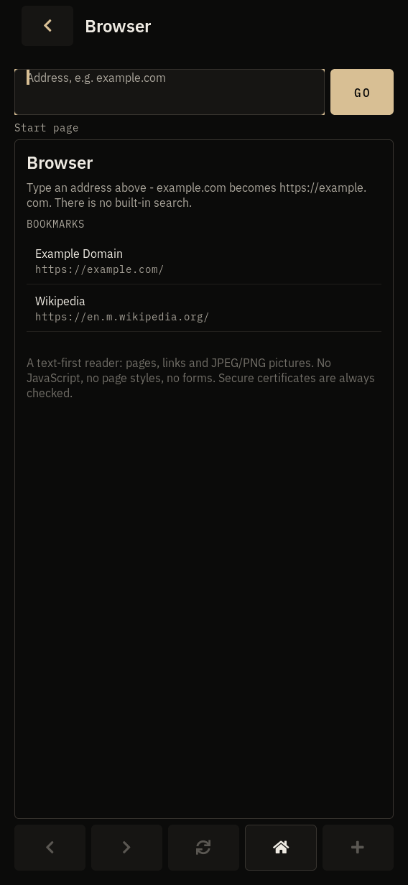
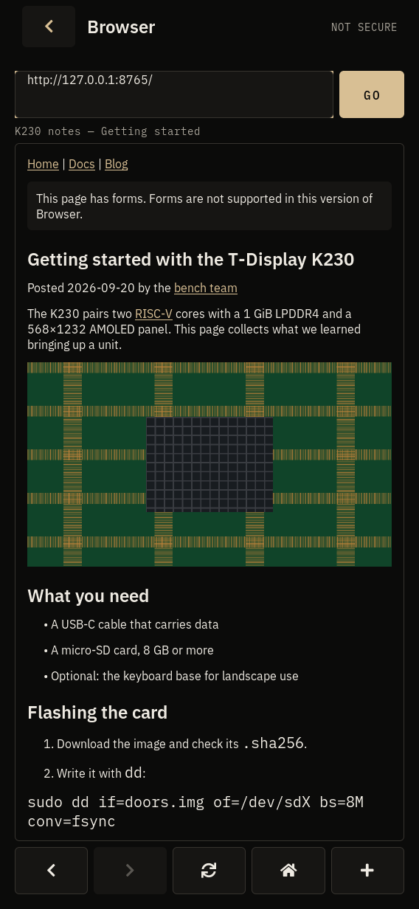
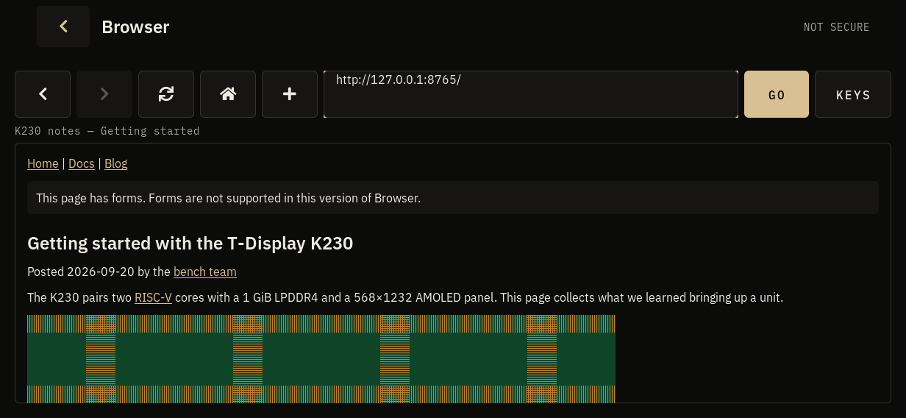
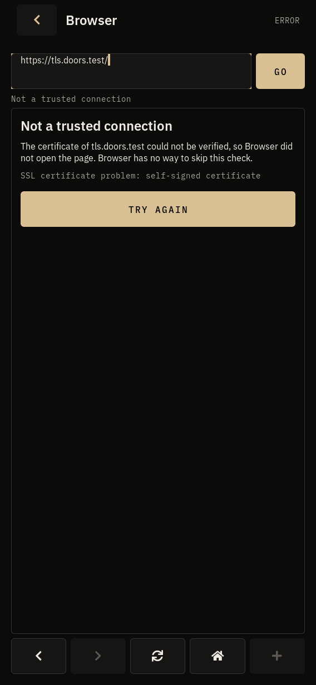

# Browser: simple web pages on the unit

**Status: ACCEPTED** (proposed 2026-09-26, merged to master `c7b7a8f` and
accepted by the owner 2026-09-27). The engine decision is ADR-009
(ACCEPTED 2026-09-27). Built with the pinned Xuantie/Buildroot
toolchain and run on unit A on 2026-09-27: every check of the focused gate
passed, the physical keyboard checked by the owner
(docs/hardware/BROWSER_GATE.md, §11).

Browser reads simple web pages: text, headings, lists, links, JPEG and PNG
pictures, over HTTP and HTTPS. It follows links, goes back and forward,
reloads and stops, remembers bookmarks and recent pages, and works in
portrait and landscape. It is a text-first reader, not a desktop browser:
there is no JavaScript, no CSS layout and no forms.

Contents:

1. What the platform offers
2. The engine: why a reader
3. Architecture
4. What it shows, and what it does not
5. Navigation and addresses
6. Limits, memory and dependencies
7. Security and privacy
8. The screen
9. What it remembers
10. The fake network, the bench tool and the tests
11. Validation, measurements and hardware work
12. Known limitations and next steps

---

## 1. What the platform offers

Evidence classes follow AGENTS.md. Most rows repeat docs/apps/ZABBIX.md §1,
which was checked against the image build; the rest are marked.

| Area | Finding | Class | Evidence |
| --- | --- | --- | --- |
| Web engines | **none**: no WebKit/WPE/cog, Qt WebEngine, Chromium, Firefox, NetSurf, Dillo, Links, Lynx | CONFIRMED | ZABBIX.md §1 (`.config`) |
| Windowing | none: LVGL 9.5 on DRM is the only graphics stack; DRM master handoff to another process is unproven (ADR-002 point 6) | CONFIRMED | ZABBIX.md §1; ADR-002 |
| HTTP/TLS | libcurl 8.12.1 on OpenSSL 3.4.1, Mozilla CA bundle in `/etc/ssl/certs` | CONFIRMED | ZABBIX.md §1 |
| Pictures | libjpeg 9 and libpng (headers in the sysroot, for OpenCV); zlib | CONFIRMED | CAMERA_PLATFORM_RESEARCH.md; ZABBIX.md §1 |
| LVGL spans | `lv_spangroup_get_span_by_point` exists at the pinned LVGL commit; `LV_USE_SPAN` is 1 in LVGL's template | VERIFIED (source) | vendor/lvgl @ 59dc7e4 |
| LVGL spans on the device | the vendor `lv_conf.h` is not the shell's; `LV_USE_SPAN` is 1 in the SDK sysroot's `lvgl/lv_conf.h`, its `liblvgl.so.9` exports `lv_spangroup_*`, and the shell on unit A draws pages with links | VERIFIED | docs/hardware/BROWSER_GATE.md §2 |
| Image cache | `LV_CACHE_DEF_SIZE 0` on the device | CONFIRMED | DOORS_APP_ICONS_GATE.md |
| Fonts | IBM Plex bitmaps: ASCII, Latin-1, some punctuation and arrows; no CJK, no emoji, no bold/italic text faces for body text | CONFIRMED | tools/design/gen_fonts.sh |
| Network | Ethernet (ifupdown) and Wi-Fi (netd); DNS from udhcpc | CONFIRMED | ZABBIX.md §1 |
| Clock | no RTC: 1970 until NTP answers, so certificates cannot be checked before then | CONFIRMED | T-DISPLAY-K230.md |
| RAM, storage | 1 GiB (about 930 MB available); 600 MB rootfs, about 120 MB free | CONFIRMED | ZABBIX.md §1 |
| Toolchain | glibc, gcc 14 (Xuantie), C11 | DOCUMENTED | BUILD_ENVIRONMENT.md |

## 2. The engine: why a reader

ADR-009 compares the options in full. In short:

| | WPE/Chromium/Qt WebEngine | NetSurf / Links2 / Dillo | **First-party reader (chosen)** |
| --- | --- | --- | --- |
| New packages | many, and a graphics stack | several (NetSurf: libcss, libdom, hubbub, libnsfb ...) | **none** (libpng becomes a build dependency; it is in the image) |
| Display | its own (EGL/Wayland) | its own framebuffer/X11 frontend, DRM handoff | **LVGL, in the shell, like every app** |
| Size on the rootfs | tens to hundreds of MB | 3-5 MB | **about 210 KB** (§6) |
| JavaScript | yes | no | no |
| CSS layout | yes | NetSurf: good; Links/Dillo: partial | no (a readable single column) |
| Looks like Doors, keyboard rules, both orientations | no | no | **yes** |
| Untrusted input | in its own process | in its own process | **in pos-browser, never in the shell** |

The priorities were stability, usable rendering, low memory, a responsive
UI, HTTPS, navigation, and only then web features. A reader built from
libraries the image already carries meets the first five without a platform
change; the engines above trade them for compatibility the owner ranked
last.

## 3. Architecture

```text
 Browser screen (apps/browser/browser_app.c, LVGL)           shell process
   │  browser_view.c  what is shown and allowed (pure C)
   │  browser_session.c  the helper's lifecycle (pure C)
   │  core/web: web_doc, web_proto, web_url, web_history, web_store
   │
   │ socketpair, line protocol (web_proto.h)      + picture files (RGB565) in
   ▼                                                 /run/pocketos/browser.XXXXXX (0700)
 pos-browser (tools/browser/pos_browser.c)                   helper process
   core/web: web_fetch (redirect rules) → web_fetch_curl (libcurl + OpenSSL)
             web_html (HTML → document), web_image (libjpeg, libpng)
             web_fake (the fake network)
```

- **The helper starts with the first page**, not when the app opens: the
  start page costs nothing but itself. It lives while the screen is open and
  goes with it (`quit`, SIGTERM, then SIGKILL after 300 ms at most), and with
  the shell (`PR_SET_PDEATHSIG`; the socket is close-on-exec).
- **The LVGL thread never waits on the network.** It reads a socket that
  already has data (`MSG_DONTWAIT`, at most 64 reads per 40 ms tick) and
  picture files the helper finished writing.
- **Watchdog**: no hello in 3 s, silence past 60 s while loading, or a STOP
  not answered in 4 s kills the helper. A helper killed for ignoring a STOP
  while a newer page waits is replaced and the page sent again, with no error
  shown. More than four failures a minute stop automatic restarts; the page
  says why.
- **The document crosses as data**: blocks and runs, link addresses, picture
  descriptions. The shell's reader (web_rx) checks every line - ids in order,
  every reference in range, every number bounded, a "supported" link must be
  an http(s) address - and drops a damaged page whole.
- **Pictures cross as pixels**: the helper decodes and scales each picture to
  the page width and writes exactly w×h RGB565 pixels to a file named
  `<seq>-<id>.rgb565` in the session's 0700 directory; the shell opens it
  without following links, checks its size, reads it and deletes it. The
  shell never sees image file formats.
- **Drawing is incremental**: one LVGL object per block (a label, a span
  group when there are links, an image), made at most 8 ms per tick and
  grouped 24 to a chunk, so a long page never holds a frame and each new
  block only lays out its own chunk (§11: 800 blocks went from 862 ms to
  125 ms on the PC with chunks).

## 4. What it shows, and what it does not

| Feature | Status | Notes |
| --- | --- | --- |
| HTML | **partial** | a one-pass reader (web_html.h): p, div and the other block elements, h1-h6, ul/ol/li, dl, pre, blockquote, hr, br, table rows (cells joined by " \| "), a, img, title, base, meta charset, meta refresh (shown as a link, not followed), noscript (shown). No DOM, no layout |
| Text | **supported** | UTF-8; ISO-8859-1, windows-1252 and US-ASCII converted; other charsets read as UTF-8 with a note. Entities: numeric and the common named ones. Characters outside the Plex bitmaps (CJK, emoji) draw as placeholder boxes |
| CSS | **unsupported** | only `hidden`, `aria-hidden="true"` and an inline `display:none`/`visibility:hidden` hide an element. One readable column, in the Doors theme |
| Inline styles | **partial** | links (accent, underlined), inline code (monospace); bold and italic are kept as flags but drawn plain (no bold/italic body faces in the Design System fonts) |
| Pictures | **partial** | JPEG and PNG (transparency over white), scaled to the page width, at most 16 per page; GIF, WebP, SVG, AVIF show their alt text. Trackers (1-2 px) and icons (under 40×40) are dropped or shown as their alt text |
| HTTPS | **supported** | libcurl + OpenSSL, peer and host name always verified against the system store; no way to skip |
| HTTP | **supported** | when written as `http://`, or offered when an address Browser made https cannot be reached on https (never silently, never after a certificate failure) |
| Redirects | **supported** | up to 8; never https → http; never to anything but http(s) |
| JavaScript | **unsupported** | scripts are skipped; noscript content is shown |
| Cookies | **partial** | kept in memory for as long as the app is open (logins that set a session cookie work within a visit); never written to disk |
| Forms | **unsupported** | a page with forms says so once, where the first one is |
| Downloads | **unsupported** | anything that is not a page, text or a JPEG/PNG is refused with its type and size |
| Frames | **partial** | an iframe becomes a link to its page |
| Bookmarks | **supported** | the + button on a page; listed on the start page |
| Recent pages | **supported** | the last 12 pages that loaded, on the start page, clearable |
| Back / forward / reload / stop / home | **supported** | §5 |
| HTTP authentication, proxies, find in page, zoom | **unsupported** | libcurl honours the `http_proxy`/`https_proxy` environment of the shell, which the image does not set |
| Page title | **supported** | in the status line and the history |
| Favicons | **unsupported** | |

## 5. Navigation and addresses

- **Typing**: `example.com` becomes `https://example.com/`. Spaces mean
  words, not an address, and are refused (there is no built-in search, on
  purpose). `http://` is used only when written. User names and passwords in
  addresses, international (non-ASCII) host names, and every scheme but
  http, https and the Browser's own `about:home` and `about:blank` are
  refused with a sentence that says why (web_url.h).
- **https first, http only by choice**: when an address Browser made https
  cannot be reached on https (refused, no answer, unreadable answer), the
  error page offers **OPEN WITH HTTP:// (NOT SECURE)**. It never switches on
  its own, never offers it after a certificate failure, and never follows an
  https page's redirect to http.
- **The back/forward list** (32 entries) changes only when a page or an
  error for it arrives, so a load that is stopped or replaced leaves it as it
  was. An error page is an entry, so BACK leaves it. A redirect's final
  address replaces the requested one.
- **STOP** ends a load at once on screen: the previous page (or the start
  page) stays, and anything that arrives for the stopped load later is
  dropped by its sequence number. While pictures are loading, the same button
  stops them.
- **HOME** shows the start page (`about:home`), which never reaches the
  helper.
- Links to `mailto:`, `tel:`, `javascript:` and the like are drawn muted and
  say "... links cannot be opened in Browser" when tapped.

Error pages name the failure in words and keep the technical detail below
them: no network (no default route: "Connect to Wi-Fi in Settings"), server
not found, could not connect, no answer in time, not a trusted connection,
clock not set, too many redirects, insecure redirect, cannot show this
(downloads), unreadable answer, and the helper itself failing.

## 6. Limits, memory and dependencies

| Limit | Value | Where |
| --- | --- | --- |
| Page body | 2 MB (kept up to the cap, marked cut) | WEB_PAGE_BYTES_MAX |
| Text in a page | 256 KB | WEB_DOC_TEXT_MAX |
| Blocks / runs / links | 800 / 4000 / 500 | web_doc.h |
| Pictures | 16 per page; each at most 560 K pixels, 1600 px a side, 1.5 MB fetched; 1.5 M pixels per page in the helper and 3 MB per page in the shell | web_doc.h, web_proto.h, pos_browser.c, browser_view.h |
| Picture sources | JPEG up to 64 Mpx (decoded at 1/2, 1/4 or 1/8 and one row at a time); PNG up to 4 Mpx | web_image.h |
| Redirects | 8 | WEB_FETCH_REDIRECTS |
| Timeouts | connect 15 s, whole request 45 s, below 1 byte/s for 20 s | web_fetch.h |
| Address | 2047 bytes | WEB_URL_MAX |
| Back/forward | 32 entries | WEB_HISTORY_MAX |
| Remembered | 12 recent, 24 bookmarks, 64 KB file | web_store.h |

The worst-case document is about 340 KB in either process; the protocol
refuses anything larger. The helper returns freed memory to the system after
each page (`malloc_trim`).

**Dependencies.** No package is added. The Doors package gains `libpng` as a
build dependency; libcurl (with OpenSSL) and jpeg already were (Zabbix,
Camera). All three are dynamically linked and already in the image and its
legal manifest (docs/LICENSING.md):

| Library | Version in the image | Licence | Used for |
| --- | --- | --- | --- |
| libcurl | 8.12.1 | curl (MIT-style) | HTTP, HTTPS, redirects, cookies in memory, gzip/deflate |
| OpenSSL | 3.4.1 | Apache-2.0 | TLS, through libcurl |
| libjpeg | 9f | IJG | JPEG pictures |
| libpng | 1.6 | libpng | PNG pictures |

**Binary size (riscv64, -O2, measured on the cross build, §11):** pos-browser
110 KB (97 KB stripped); the Browser code in the shell about 70 KB; the icon
mask 1 KB in the shell and the launcher icon 27 KB in `/usr/share/doors/ui`.
About 210 KB on the rootfs in all.

## 7. Security and privacy

- **Web content is untrusted, and stays out of the shell**: HTTP, TLS, the
  HTML reader and both decoders run only in pos-browser; the shell parses only
  the line protocol, with every field checked (§3). tests/browser_lint.sh
  holds the layering.
- **No shell, no files, no IPC from a page**: nothing in core/web, the helper
  or the app runs a shell or looks a program up on PATH (the only exec is the
  helper, by absolute path); `file:` and every other scheme are refused before
  libcurl, and libcurl is held to http and https for requests and redirects.
  Page content cannot name a Doors service or a local path: the only files
  the helper writes are the session's picture files, by its own names.
- **TLS**: verification always on; an unset clock is said as such. The CA
  file option exists for the bench tool and for the simulator's test hooks
  only (`POCKETOS_BROWSER_CA_FILE` is compiled into simulator builds alone).
- **Logs** carry a page's scheme and host, never its path or query (which can
  hold tokens), and never cookies.
- **Stored state** is 0600 in a 0700 directory, written atomically without
  following links; a planted `javascript:` or `file:` address in the file makes
  the whole file untrusted (defaults are used). No passwords, cookies, form
  data or page content are stored.
- **Cookies** live in the helper's memory and die with it: closing Browser
  ends every session with every site.
- **Third-party pictures** are fetched like a desktop browser does (they can
  track a visit). There is no referrer or cookie restriction beyond libcurl's
  defaults; a "no pictures" switch is a next step if wanted.

## 8. The screen

Screenshots from the simulator are in `docs/apps/browser/`.

| Portrait start page | Portrait page | Landscape page | Loading | Error |
| --- | --- | --- | --- | --- |
|  |  |  |  |  |

Also: `portrait-demo.png` (the fake network's demo page: links, list, picture, quote, code, the form note) and `portrait-error-connect.png` (a refused connection, with the http:// offer).

- **Portrait**: the address field and GO on top; the status line (page
  title, loading progress, or what went wrong); the page, which scrolls
  vertically; BACK, FORWARD, RELOAD/STOP, HOME and + (bookmark) at the foot,
  where the thumb is.
- **Landscape**: the five buttons, the address field, GO and KEYS in one
  row; the status line; the page. With the touch keyboard up only that row is
  left.
- **The keyboard** follows Wave's rules (DS 17.3): in portrait a tap on the
  address field brings the touch keyboard up, and going somewhere, tapping
  the page or a link puts it away; in landscape - where the physical keyboard
  is - a tap only focuses the field, and KEYS brings the touch keyboard up.
  Enter, from any keyboard, goes.
- **The header hint** says LOADING, SECURE (https), NOT SECURE (http) or
  ERROR, in words (DS §2).
- The app is fullscreen (DS §30.4) and uses only role styles (style lint).
  A theme change remakes the page in the new colours.
- **Launcher**: CONNECTIONS, after Zabbix, in the network colour, with a
  first-party globe icon (docs/design/doors-app-icons/). Portrait still fits
  without scrolling (CONNECTIONS takes a second row); landscape keeps its two
  lines. The owner confirmed the place and the icon on 2026-09-27.

## 9. What it remembers

`$POCKETOS_STATE_DIR/browser/state` (`/var/lib/pocketos/browser/state`):

```text
doors-browser-state 1
home<TAB>about:home
last<TAB>https://example.com/
recent<TAB>https://example.com/<TAB>Example Domain
bookmark<TAB>https://en.m.wikipedia.org/<TAB>Wikipedia
```

- Read at open (a few hundred bytes), saved at most every 3 s after a change
  and when the app closes.
- The first run has two neutral bookmarks, example.com and the Wikipedia
  mobile site; neither is a search engine, both can be removed.
- A line that is not a known entry or holds a disallowed address is skipped;
  the other bookmarks and recent pages are kept, and the log names the first
  bad line.
- A file with another version, junk, a NUL byte, over 64 KB, or a symbolic
  link is not used: the defaults are, the log says why, and before the next
  save the file is renamed to `state.bad` (one kept), never written over.
- A file that is there but cannot be read (no permission, an I/O error) gives
  the defaults for that run and is not written at all: changes made in that
  run are not saved.

## 10. The fake network, the bench tool and the tests

`pos-browser dump [--fake] [--ca-file FILE] URL` prints a page as text with
its links numbered, and a line on stderr with its size in memory: the bench
check that the unit can reach and read a site, without the screen.

`--fake` answers from web_fake.c: `https://doors.test/` (a demo page with a
picture), `/about`, `/long`, `/big` (3 MB), `/text`, `/latin1`, `/missing`
(404), `/redirect`, `/loop`, `/insecure` (https → http), `/file` (→ file://),
`/zip`, `/garbage`, `/slow` (5 s, stoppable), `/hang` (unstoppable), `/crash`,
and hosts `tls.`, `clock.`, `timeout.`, `refused.`, `offline.doors.test`. The
simulator uses it with `POCKETOS_BROWSER_BACKEND=fake`.

| Suite | What it holds | Checks |
| --- | --- | --- |
| tests/web_url_test.c | normalization, malformed and refused addresses, link resolution | 76 |
| tests/web_html_test.c | ordinary pages, what is skipped, charsets and entities, hostile input, every limit, 3000 rounds of tag soup and 2000 of random bytes | 51 |
| tests/web_proto_test.c | round trip, pieces, every kind of damaged or lying line | 38 |
| tests/web_history_test.c | back/forward, bounds | 16 |
| tests/web_store_test.c | defaults, save/load, permissions, bounds, corrupt and planted files, links | 29 |
| tests/web_fetch_test.c | redirect rules, cut pages, STOP, Content-Type, no-network detection | 21 |
| tests/web_image_test.c | fitting, JPEG/PNG made with libjpeg/libpng, truncated and oversized files, 4000 mutated files | 24 |
| tests/browser_view_test.c | every button, the list changing only on answers, STOP, stale answers, error pages and offers, picture budget, persistence, helper failures | 59 |
| tests/browser_session_test.c | the real helper: page and picture, STOP, replace, failures, crash, stuck helper, no hello, no helper, 50 open/close cycles (no process, descriptor, file or directory left) | 33 |
| tests/browser_http_test.sh (.py) | libcurl against local HTTP/HTTPS: redirects and their rules, certificates (self-signed, CA file, wrong name), gzip, a gzip bomb, cut answers, non-HTTP answers, cookies, pictures, STOP, logs | 36 |
| tests/browser_shell_test.sh | the simulator: start page, a page in both orientations with its picture on screen, an error page, a theme change, 30 open/close cycles (no helper, no directory, no memory growth), the shell killed | 23 |
| tests/browser_lint.sh | layering, schemes, TLS, redirects, cookies, logs, permissions, lifetimes, packaging | 28 |

`make browser-san-test` builds and runs the unit, protocol, view and session
suites and the helper under ASan and UBSan. `make test` runs all of the above
but the shell test, which needs the CMake simulator (like the other
`*_shell_test.sh`).

## 11. Validation, measurements and hardware work

**VERIFIED on the host (x86-64, 2026-09-26):** everything in §10, with
`-Werror`, and under ASan/UBSan; the simulator in both orientations; a real
HTTPS site (pypi.org, through the build host's proxy with the system CA store)
read and drawn: 255 KB of HTML became 574 blocks, 453 links and 16 pictures
(all SVG badges, shown as their alt text) in 106 KB, made in 31 ms over two
ticks. Twenty minutes later the same site served a JavaScript bot challenge,
which Browser shows as the site's own "JavaScript is disabled" text.

**VERIFIED by cross-build (riscv64):** `make all` of every first-party
program with `-Werror`, and the DRM shell with LVGL at the pinned commit, with
Ubuntu's riscv64-linux-gnu-gcc 13 against Ubuntu 24.04 riscv64 libraries
(libcurl 8.5, OpenSSL 3.0, libpng 1.6.43, libjpeg-turbo 8, and libgpiod 2.2.4
built for the check). All Browser suites pass on riscv64 under qemu-user,
including the helper lifecycle and the real HTTP/HTTPS suite.

**VERIFIED with the pinned Xuantie gcc 14 and the SDK sysroot (2026-09-27):**
`make all` as `pocketos.mk` builds it (`BROWSER_CURL=1 BROWSER_IMAGES=1`),
`-Werror`, 0 first-party warnings, and the DRM shell. That needed one
fix: gcc 14 vectorizes a loop in `web_image.c` for RVV and then warns about
its own masked lanes, so the loop is marked `#pragma GCC novector`.

**Measurements (host, x86-64; the C908 will be slower, the gate measures it):**

| What | Value |
| --- | --- |
| Browser start page, from open to drawn | 9 ms; no helper |
| Shell RSS: launcher → start page → typical page (pypi) | 13.3 → 13.6 → 14.2 MB (about +0.9 MB for a 574-block page) |
| Shell RSS, 800-block page (the block limit) | +1.1 MB over the start page |
| Shell RSS after 100 open/close cycles with a page and a picture | flat from the 20th cycle (14 236 KB at 20, 40, 60, 80 and 100) |
| Helper, idle after start | 5.6 MB private (10.4 MB RSS with shared libraries) |
| Helper after the first HTTPS page | 8.6 MB private (OpenSSL and the CA store are loaded once) |
| Helper peak, six 1200×900 PNGs decoded | 17.3 MB RSS, back to 13.9 MB after the page (`malloc_trim`) |
| Building an 800-block page (labels) | 125 ms over 4 ticks (862 ms before chunking) |
| Building the demo page / a 301-block page | 1 ms / 39 ms |
| CPU while idle | simulator shell 0.7 % at the launcher, 0.9 % with Browser open on a page (10 s samples); the helper 0 (it sleeps in `poll`). The app's 40 ms timer makes one non-blocking `recv` and one `waitpid` |

**Unit A gate (2026-09-27, build `301fadf`): PASS.** The sheet is
docs/hardware/BROWSER_GATE.md. Passed:

- both orientations;
- the touch keyboard in both;
- the physical keyboard in landscape, typing and Enter (owner);
- example.com over HTTPS;
- certificate checks (expired, wrong host, self-signed, untrusted root all
  refused);
- links, scrolling, BACK/FORWARD/RELOAD/HOME;
- a bookmark kept across app, rotation and service restarts;
- Wi-Fi dropped during a load, and recovery with RELOAD;
- rotation both ways while open;
- 20 open/close cycles, every fifth closed mid-load: no helper or
  directory left, shell pid and supervisor count unchanged, shell RSS flat
  at about 15.2 MB;
- JPEG and PNG pictures.

On the C908:

- start page 19-23 ms;
- Wikipedia's 623-block Main Page made in 204-357 ms over 6-9 ticks;
- doors-shell 15-16 MB RSS, pos-browser 7-8 MB;
- CPU idle 0-1 % with a page open, peaks of 18 % (shell) and 8 % (helper)
  while a page is built.

**Still open:**

1. STOP tapped on a running load (only closing mid-load was exercised).
2. HTTPS before NTP (the "Clock not set" page).
3. netd restarted during a load, and a page opened with no network at all.
4. Frame rate while fling-scrolling, and an 800-block page on the C908.

## 12. Known limitations and next steps

- No JavaScript, no CSS layout, no forms: sites that need them (single-page
  apps, bot challenges, most web mail) do not work. Documentation, text
  sites, Wikipedia's mobile pages and simple local admin pages do.
- Bold and italic are not drawn as such; there is no text-size setting.
- GIF, WebP and SVG pictures show their alt text.
- Characters outside the Plex bitmaps (CJK, emoji, many symbols) are
  placeholder boxes; right-to-left text is not reordered.
- Only one page loads at a time; there are no tabs.
- Name resolution cannot be interrupted if the C library resolver is
  synchronous; the 4 s STOP watchdog replaces a helper stuck there.
- No `about:` pages beyond the start page; the home page is always the start
  page (the setting exists in the file, not yet in the UI).
- Next, if the owner wants them: GET forms with one text field; a "no
  pictures" switch; text size; find in page; HTTP basic authentication
  (never stored).
