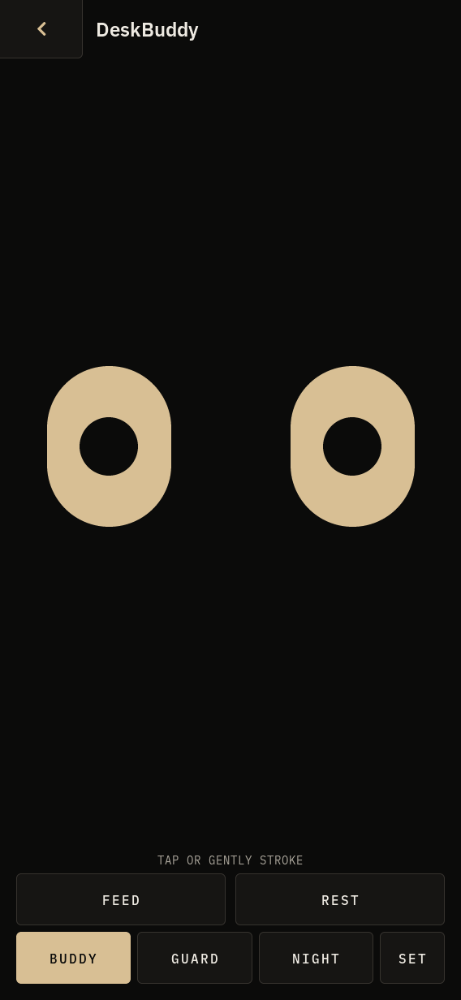
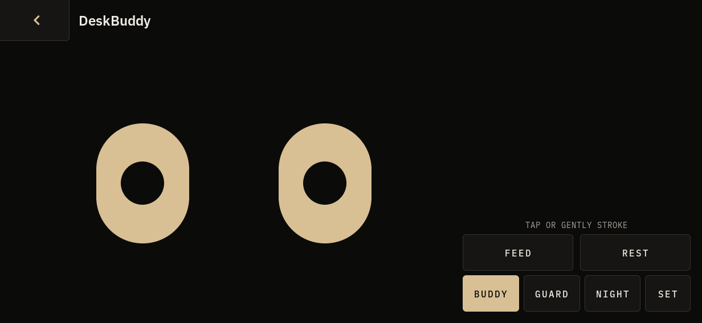

<!-- Copyright (c) 2026 PocketOS authors. SPDX-License-Identifier: Apache-2.0 -->
# DeskBuddy personality — candidate opus

Starting point: exact `origin/master` **e4bed1c8702e52a70ffb6e728c8ae56ca523400c**.
Branch: `feat/deskbuddy-personality-opus`; isolated worktree:
`/workspace/work/deskbuddy-opus`. The other candidate was neither inspected nor
modified. The SDK, shared build trees, devices and R1-A artifacts were untouched.

## Design and implemented slice

The existing themed eyes remain the character. Their asymmetric curious look,
heavy lids, happy arches and wary lids are reused, with a small mouth for
surprise, contentment and chewing. Reaction geometry interpolates for 160 ms;
subtle vertical movement accompanies happiness and chewing. Idle blinks and
occasional glances retain the existing scheduler. Variation cycles through three
small reaction durations/lifts rather than introducing random unrelated scenes.

- A character tap looks toward the contact, briefly startles, becomes curious,
  and settles. Three pokes with gaps under 900 ms produce 850 ms of annoyance.
  The character then returns to calm; there is no lasting penalty.
- A deliberate 350–2500 ms stroke, at least 48 logical pixels, produces a pleased
  response once on release. Small drift remains a tap; fast swipes, holds,
  scrubbing, cancelled gestures and leaving the character do nothing.
- **FEED** reveals a cookie. It follows a drag visually; dropping it on the
  character starts 1.2 seconds of chewing, then happiness, then calm. Tapping
  the cookie feeds it too. **F** reveals it; **F/Enter** feeds it; **Esc/Back**
  cancels it. A failed drop, leaving the app, settings, rotation, or 15 seconds
  of abandonment clears it without punishment. The cookie returns to its tray
  on the next Feed action.
- At 90 seconds without interaction the lids become heavy; at 120 seconds the
  eyes close. Touch wakes naturally. **REST/WAKE**, or **R**, provides an explicit
  alternative. **Space/P** gives the pleased response from the keyboard.
- Controls are outside the character gesture target and never also poke it.
  Both orientations retain the original layout and DS touch minimum.

`db_personality.[ch]` is a small pure-C reaction/gesture module, not a pet-care
framework. Its `db_personality_event()` interface can be used by a future
recognition or gesture adapter to invoke these same reactions. No recognition,
models, sound, alarms, monitoring or games were added.

Buddy selects the `none` vision provider by default, even when models happen to
be installed. Existing camera-dependent companion functionality remains available
through explicit `DESKBUDDY_VISION=pipeline`; `DESKBUDDY_VISION=none` still forces
no vision in every mode. The existing Guard/Night state rules and default camera
provider selection are retained. Switching modes stops the outgoing provider and
starts the selected one. Those modes do not acquire the new personality overlay.

Only useful existing preferences/log changes use the existing store. Gestures,
snacks, reaction state and animation frames are never persisted. One existing
app-owned LVGL timer drives everything: 20 ms only during the bounded eye
transition, 100 ms while chewing, otherwise the original next-event scheduling
capped at one second. Reduced motion removes interpolation and vertical movement
and keeps a static eating pose. Close deletes the provider, timer, callbacks and
objects; reopening starts calm without a stale gesture or snack. Global
screen-off, lock, brightness and alarms are unchanged.

## Real captures

These are **application captures, not design mockups**. The PNGs below come from
the actual `pocketos-shell` SDL simulator, using its existing LVGL snapshot/PNG
path. Full-size portrait is 568×1232; landscape is 1232×568.





[17.1-second interaction capture](deskbuddy-personality-opus/demo.gif) consists of
171 actual LVGL snapshots from the existing `deskbuddy_app_test` host running the
real app and real pointer/key stream. It shows poke/annoyance, petting, snack
tracking, feeding, cancellation and rest/wake. The test host supplies an empty
shell header; the GIF therefore differs from the two full shell captures there.
No mock character or vision event is used in this sequence. Pointer location is
not drawn in this capture. The GIF uses 100 ms frames and a 32-colour PNG-to-GIF
encoding; animations run on the app's real deadlines, with a simulated LVGL clock.

## Exact validation

Host-only, 2026-10-09. Dedicated build directory `/workspace/work/opus-build`;
LVGL source in `/workspace/work/opus-lvgl-src`, pinned at
`59dc7e436ae97a25e32656739ea6a943f9f11b6a`. Host simulator tools/libraries were
extracted into `/workspace/work/opus-host/root`, without changing the SDK or a
shared build directory. GCC 14.2.0, CMake 3.31.6, SDL 2.32.4, Debug build.

- Built both `pocketos-shell` and `deskbuddy_app_test` with the existing
  `ui/shell/CMakeLists.txt`, SDL backend, pinned LVGL, `cmake --build ...
  --target deskbuddy_app_test pocketos-shell -j8`.
- `db_personality_test`: **27 checks, 0 failures**, C11 `-Wall -Wextra -Werror`
  plus AddressSanitizer/UndefinedBehaviorSanitizer. LeakSanitizer disabled because
  this execution sandbox uses ptrace; the tested pure module allocates nothing.
- Existing `db_brain_test`: **105 checks, 0 failures**. Guard/Night, the original
  vision transitions and face geometry remain covered by those checks.
- Actual `deskbuddy_app_test`: **97 behavioral checks, 0 failures**; with capture
  enabled **457 total checks, 0 failures** (360 additional snapshot/PNG checks).
  Includes real tap/stroke/swipe, escalation/recovery, feed by drag/tap/keyboard,
  failed drop/Back, inactivity, explicit sleep/wake, rotation with a snack,
  closing while pressed, reopening, no persisted animation state, no detector,
  reduced-motion repaint budget, and the existing Guard/Night/store/lifecycle
  checks. The final capture run logged no LVGL warnings.
- `bash tests/deskbuddy_lint.sh`: **0 failures**; covers the new pure module too.
  `git diff --check`: clean.
- Ran `pocketos-shell --no-lock --rotation portrait|landscape --open deskbuddy
  --screenshot ... --exit-after-ms 1300` with empty, isolated settings/state
  directories and no vision override. A `POCKETOS_VISION_HELPER` executable
  would write a marker if invoked; **no marker was written**. Both runs opened,
  captured and closed normally. Expected host warnings: no radio daemon and
  sandbox denial of the optional shell IPC socket. No application fault.
- Visually inspected both shell orientations and the snack and pleased app
  captures. No broad shell suite, cross-build or physical test was performed.

To reproduce the interaction capture after building the existing app-test target:

```sh
mkdir -p work/deskbuddy-captures
DESKBUDDY_CAPTURE_DIR="$PWD/work/deskbuddy-captures" \
  SDL_VIDEODRIVER=dummy /path/to/build/deskbuddy_app_test
```

## Common manual comparison sequence

Use the same starting commit, theme, text size and orientation for each candidate;
empty app preferences; reduced motion off; no models or detector required.

1. Open Buddy. Observe idle for ten seconds. Tap its left eye once; watch the
   directed surprise, curiosity and return to calm.
2. Tap three times with 200–400 ms gaps. Wait two seconds for calm.
3. Stroke gently across the eyes over about 700 ms. Release; it should respond
   once. Repeat with a fast swipe, which should not count as petting.
4. Tap Feed. Drag the cookie to the character; watch its gaze and chewing.
   Repeat Feed and tap the cookie. Repeat with F then Enter on the keyboard.
5. Reveal the cookie, drag away and release; then reveal it and press Back.
   Neither cancellation should cause a poke or leave a snack behind.
6. Tap Rest, wait a second, then touch to wake. Alternatively wait 90 seconds
   for heavy lids and 120 seconds for closed eyes. Repeat with R to rest/wake.
7. Reveal a cookie and rotate. It should disappear cleanly. Repeat steps 1–6 in
   landscape. Close while dragging, reopen, and confirm calm/no stale cookie.
8. Turn on system reduced motion and repeat petting and feeding: responses remain
   understandable without movement. Check the existing Guard/Night modes.

## Limits and next slice

K230 performance and touch thresholds are **ASSUMED suitable**, not physically
verified. This slice allocates a fixed amount of reaction/gesture state, uses
existing filled objects and bounded transitions; K230 frame time, power and
real-finger feel still need a separately authorised hardware gate. Gesture
thresholds intentionally favour deliberate one-way strokes over scrubbing.
There is no sound, focus timer, personalisation or new monitoring/alarm behavior.
The explicit camera companion path is retained but was not tested with a real
camera/detector in this work.

Proposed next slice: tune these gestures/movement on hardware, then consider
small preference-backed personalisation and a foreground focus session.

- **DeskGuard:** reuse the calm/curious/welcome poses for an explicit “Away from
  desk” display now. It must say that monitoring is not active; an away display
  is not evidence that the desk is secure. Later real monitoring should feed
  verified events into the same character, with explicit camera permission,
  lifecycle and retention decisions. The existing Guard behavior is unchanged
  in this PR.
- **NightDesk:** sleeping character, the existing clock, dim role presentation
  and integration with the existing alarm runtime. Do not add another alarm
  scheduler or override global lock/screen-off. It remains a future design.
- **Optional sounds:** default Off, then Touch only or All as saved preferences.
  Very short bounded cues; respect system mute/volume and existing audio
  ownership. No sound after close, background attention demands or punitive cues.
  New audio ownership still requires the ADR-002/004 review; not implemented here.
- **Focus and light personalisation:** an optional foreground session, a subtle
  end pose, and a name or restrained expression preference saved only when
  changed. No streak penalties, hunger meters, compulsory care or notifications.
