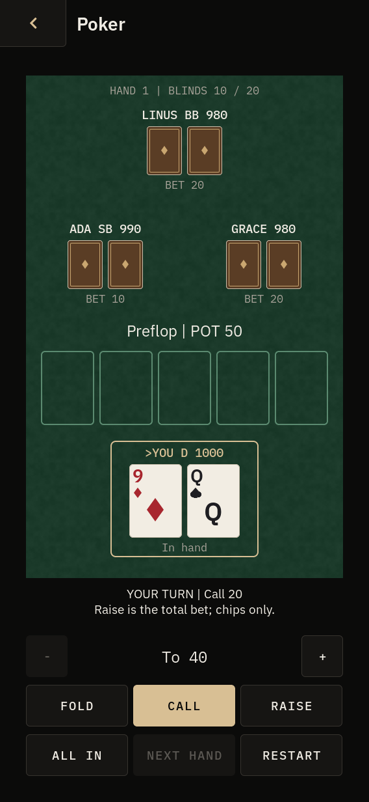
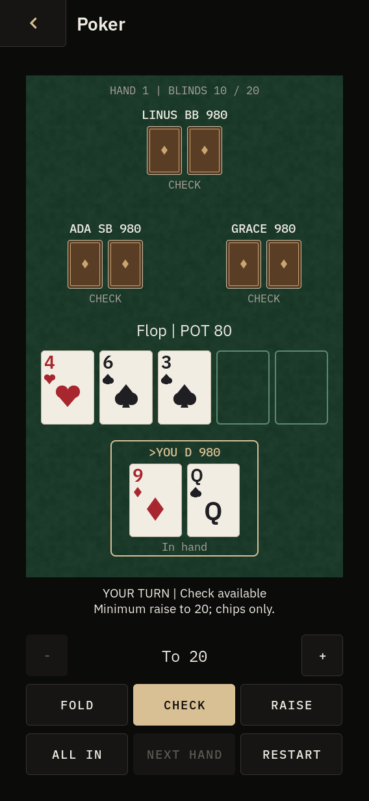
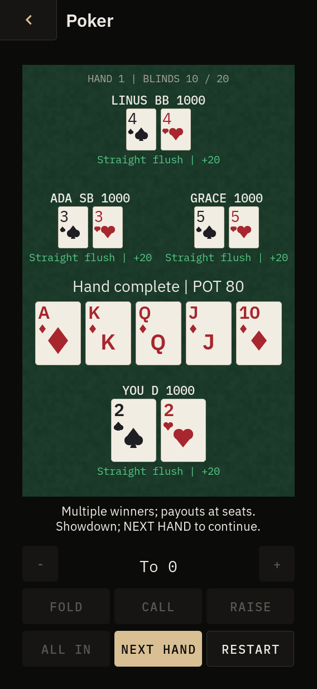

# Poker

Offline, single-player no-limit Texas Hold'em against Ada, Linus and Grace.
Open **Games → Poker**. Each seat starts with 1,000 fictional chips; blinds
stay at 10 / 20. There are no accounts, network requests or real-money bets.

## Controls

The outline and `>` identify the active seat. `D`, `SB` and `BB` identify the
dealer/button and blinds. Opponents' cards stay hidden until showdown;
folded cards are never revealed. The table shows stacks, bets, community
cards and the pot. Winners and their payouts appear at the end of a hand.

| Touch | Keyboard | Action |
| --- | --- | --- |
| Fold | F | Leave this hand |
| Check / Call | C or Enter | Check for free, or pay the call (including a short all-in) |
| − / + | Left / Right, Down / Up, − / + | Adjust the raise target by one big blind |
| Raise | R | Raise **to** the selected total street bet, including chips already posted |
| All in | A | Commit the remaining stack when legally allowed |
| Next hand | N or Enter after settlement | Deal the next hand and move the button |
| Restart | G | Ask to restart; press again to restore 1,000 chips per seat |
| Shell Back | Escape / Back slab | Cancel a restart prompt, otherwise leave the app |

Buttons that cannot legally act are disabled. AI makes one action per shell
tick, so its turn remains visible. If only all-in players remain, the board
runs out automatically. The game ends when you lose your stack or win the
table. Busted opponents sit out subsequent hands.

## Implementation

`apps/poker/engine/` is fixed-size, allocation-free C and has no LVGL, I/O,
clock or external dependency. It reuses Blackjack's existing card byte,
Fisher–Yates shuffle and seeded xorshift/rejection-sampling RNG. The app
seeds it from the clock and LVGL tick, consistent with the other card games;
it is intended for fictional offline play, not cryptographic wagering.

The engine tracks street and hand contributions separately. Full raises
set the next minimum increment; short all-ins do not, and cumulative short
raises reopen a seat only after its previous full increment has been met.
A check before a short opening bet retains raising rights. The big blind
has its preflop option and the button is the small blind in heads-up play.
The big blind advances when the table transitions to heads-up.
Unmatched chips are refunded; displayed settled pots/winnings exclude those
returned chips. Each contribution tier settles independently, folded seats
are ineligible, ties split integer chips, and odd chips go to
the first tied winners clockwise from the button. The seven-card evaluator
compares all 21 five-card combinations, including ace-low straights.

AI uses starting-hand strength before the flop and sixteen bounded equity
trials afterwards, then compares strength to the price of calling and uses
bounded aggression for raises. It sees only its own hole cards and the
public board; it cannot inspect other hands or the shuffled deck.

The LVGL app uses the standard create/tick/destroy/back lifecycle, one key
sink, PocketUI role styles and tokens, and the existing Blackjack card
renderer/palette and Timber felt. Their existing licensing and notices are
unchanged. The app is portrait-only. It starts no threads, timers, services
or background work. Closing pauses the fixed-size session; reopening within
the same shell resumes it. **Session state is not saved to disk** and resets
when the shell/device restarts. No hardware validation is claimed.

## Validation

See [the recorded cloud results and limitations](poker/VALIDATION.md).

Activate the published cloud host environment first:

```sh
source /workspace/.k230-host/activate.sh
cd /workspace/K230
make -j4 CC=gcc poker-test games-test
make CC=gcc poker-san-test
cmake --build out/cloud-shell --target pocketos-shell poker_app_test -j4
SDL_VIDEODRIVER=dummy out/cloud-shell/poker_app_test
SHELL_BIN=$PWD/out/cloud-shell/pocketos-shell bash tests/poker_shell_test.sh
```

The engine suite checks the exact category frequencies over every one of
the 2,598,960 five-card combinations, seven-card tie breakers, deck integrity,
legal/illegal bets, short/cumulative all-ins, street order, side pots, split
pots/odd chips, refunds, blinds/button rotation, folds, restart and randomized
chip conservation. Sanitizers run the same engine tests. The LVGL test drives
real pointer/key input and checks initialization, resume and repeated close
cleanup. The shell test checks registration, navigation, screenshots and
layout audits at all text sizes and across the DOORS themes/modes.

Review captures from the headless SDL simulator (568 × 1232):

| Preflop | Flop | Four-way split, Large text |
| --- | --- | --- |
|  |  |  |

Generated screenshots are in `out/poker/screenshots/`. Review fixtures are
available through `DOORS_POKER_SCREEN=preflop|flop|showdown|split|gameover`; they are
deterministic and never replace the session or advance AI automatically.

Existing cloud baseline limitations remain separate from Poker: the full
native suite stopped on two Terminal process-cleanup assertions; its
first-boot fixture expects a vendor file the current apply
script deliberately removes; GCC 14 reports existing warnings under
`-Werror`; the broader CMake default target has a Recorder/LVGL API mismatch.
Use explicit simulator/app targets. Building an SD image/cross binary needs
the pinned K230 SDK and Xuantie toolchain, which this host setup does not
provide.
