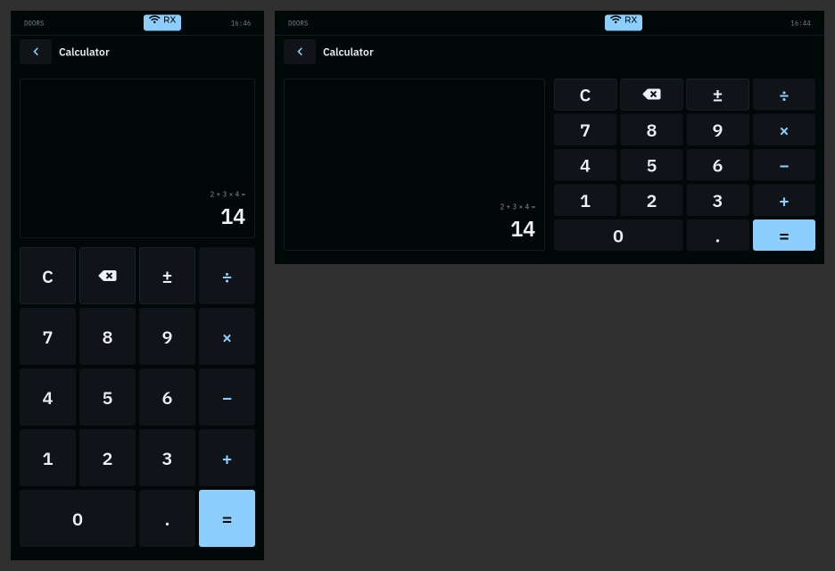

# Calculator in landscape: unit A gate

Branch `feature/calculator-landscape`, from master `8099e79` (Doors v0.0.10).
Code `2203c2a`, docs `667ca37`; the build on unit A is `667ca37`.

**Result: PASS on unit A, 2026-09-16** - remote validation, then the product
owner's physical check, which also approved the 10 px portrait keypad lift.
An unplanned, unclean reset during the physical check was recovered from
normally and is recorded below as additional evidence, not as a failure.
**The product owner ACCEPTED the work and DS Amendment F (§22) on
2026-09-16, for merge to master.** VERSION stays 0.0.10.

Scope: Calculator only. No other app, no rotation policy, no keyboard
presence logic, no boot splash, no first-boot or vendor-launcher behaviour,
no Phase 4.

## What changes

Calculator lays out in one frame that is exactly the body's content box and
chooses its shape from that box's size (DS §22.1): tall in portrait, display
above keypad as before; wide in landscape, display left and keypad right,
equal widths, the rows sharing the height. The frame pads its foot by however
far the panel's rounded corner squares reach into it (DS §22.2), so the
bottom row of keys clears the 30 px corners; in portrait that lifts the keypad
10 px and shortens the display 10 px, and every key keeps 126 x 128. Details:
`docs/apps/POCKETCALCULATOR.md` (Layout).

*Unit A's own panel (DRM framebuffer through `ffmpeg -f kmsgrab`, half size),
after the keys were tapped through the touch device: portrait left, landscape
right.*

## Host validation

From fresh clones of `667ca37` and, for comparison, master `8099e79`.

| Check | Result |
| --- | --- |
| `make all` (-Werror) | rc 0, 0 warnings |
| `make test` | 3,723 ok, 0 FAIL, 0 warnings (v0.0.10 release record: 3,719; the four new lint checks) |
| SDL simulator build | rc 0, 0 warnings |
| 20 shell and UI test scripts | 483 ok, 0 FAIL, every script rc 0 (release record: 470; `calculator_shell_test.sh` 19 -> 32) |
| `calc_app_test` | 456 checks, 0 failures (was 171), no LVGL warning in its output |
| `calc_engine_test` / `calc_view_test` / `calculator_lint.sh` | 288 / 197 / 54, 0 failures |
| `display_geometry_shell_test.sh` | 69 ok, 0 FAIL: all eleven apps still open in landscape |
| riscv64 `make all` (ENABLE_SX1262=1) | rc 0; 4 warnings, all `vendor/ggwave` (as in the release); 0 first-party |
| riscv64 DRM/sysroot shell | rc 0, 0 warnings; `Doors 0.0.10 build 667ca37` |
| Portrait, square corners, simulator | pixel-identical to master below the status bar |
| Mutations of `calc_app.c` | 10 of 11 caught, after an unmutated baseline run passed. The eleventh - the frame filling the body by flex-grow instead of 100 % height - is equivalent in LVGL 9.5 |

The mutations: corner clearance removed (for one corner, and for both), the
wide layout never chosen, the touch-minimum guard removed, the resize handler
removed, the grid rows set only after the first layout pass (LVGL warns), the
clearance taken from the sides instead of the foot, an unequal split, the
scroll position not reset, the expression not refitted on a resize.

## Unit A: remote validation

Everything below ran with nobody at the unit, over the USB serial console
(COM9, 115200). The unit had Ethernet, but SSH needs a key it does not have,
and installing one was not done.

| Step | Evidence | Result |
| --- | --- | --- |
| Identity before | `/etc/doors-release` 0.0.10 / `9f9c802`; `doors-shell` md5 `bf5885ff…`, 940,536 B; portrait, Automatic, keyboard absent; restarts 0; 0 crash reports; `shell.log` 0 ERROR, 0 WARN | recorded |
| Transfer | stripped `doors-shell` from the riscv64 DRM build, gzip + base64 over the console: 457,283 B in 95 s, md5 of the transfer equal on both ends | PASS |
| Install | rollback copy `/root/doors-shell.9f9c802`; only `S90doors-shell` stopped and started; installed md5 `a5e7e33e…` (940,720 B), 0755 root; the shell answers `build 667ca37`, supervised, running, crashloop 0, restarts 0 | PASS |
| Open | `doors app start calculator`; `shell.info` current `calculator` | PASS |
| Touch path | taps written as input events into `/dev/input/event1` (the touch controller's node), raw coordinates found by inverting the calibration the shell logged for the rotation in force, so each tap goes through the kernel input core, LVGL's evdev driver, the shell's swap and calibration, and the key under the point | used for every tap below |
| Portrait on the panel | capture of the open app against the simulator below the status bar: every pixel within 13 per channel (RGB565); `=` filled at x 422..547, y 1074..1201; only background in the 30 px corner squares at the foot | PASS |
| Portrait behaviour | `2 + 3 × 4 =` -> **14**; `1.25 × 4 = =` -> 5 (second `=` changes nothing); `7 ± − 3 =` -> -10; `9 ÷ 0 =` -> `Can't divide by 0`; `123 ⌫` -> 12; `C` -> 0; each read from the panel capture | PASS |
| To landscape | `doors call shell shell.rotation mode=landscape`: applied in place, same pid 647, restarts 0; `DRM plane rotation 270`, touch `swap 1, calibration 2400,0,0,1060 onto 1232x568`, launcher 6 x 2 | PASS |
| Landscape on the panel | against the simulator: every pixel within 13 per channel; `=` filled at x 1072..1211, y 468..537; only background in the corner squares at the foot | PASS |
| Landscape behaviour | the same six sequences, the same six results, by touch in landscape | PASS |
| Back to portrait | `shell.rotation mode=automatic`: in place, pid 647, restarts 0, portrait (keyboard absent); `2 + 3 × 4 =` -> 14 | PASS |
| Health after | 40 new `shell.log` lines, 0 ERROR, 0 WARN, no LVGL message; 0 crash reports; no crashloop marker; no segfault in `dmesg`; sysd, netd and radiod running, restarts 0; `doors-shell` VmRSS 12,672 kB with Calculator open | PASS |

At the end of the remote pass unit A ran build `667ca37`, portrait, Calculator
open, with the rollback copy in `/root`; `settings.conf` carried
`display_rotation=automatic` (it had no rotation line before, which means the
same). Captures and the bench scripts: `out/calculator-landscape-667ca37/
hwgate-unitA/` (outside the repository).

**Rollback** (if wanted): stop `S90doors-shell`, copy
`/root/doors-shell.9f9c802` to `/usr/bin/doors-shell`, start it again.

## What only the panel and a finger can show

A capture is the framebuffer, not the glass: it cannot show the rounded
corners cutting anything, and injected events cannot show where a finger
lands. So the physical check is:

1. Portrait: Calculator looks right; taps land on the key under the finger.
2. Landscape (Settings > Display > Rotation > Landscape): Calculator looks
   designed for landscape; nothing clipped or overlapping, the bottom row and
   the display's foot clear of the rounded corners; taps land on the key under
   the finger; `2 + 3 × 4 =` gives 14.
3. Back to Portrait (Rotation > Automatic): still looks right.

**Result: PASS** - the product owner at the panel, 2026-09-16, keyboard base
not attached:

| Check | Owner's finding |
| --- | --- |
| Portrait | looks correct |
| Landscape | looks intentional and usable |
| Touch | lands where tapped, in both orientations |
| `2 + 3 × 4 =` | 14 |
| Back to Automatic | restores the portrait layout correctly |
| 10 px portrait keypad lift (DS §22.2) | acceptable |

## Unplanned reset during the physical check

The owner pressed Restart by accident during the check. The unit came back
normally and Calculator worked afterwards. Recorded as regression evidence
for the deployed build, not as a failure. Read over the serial console after
the owner's report (17:10-17:12 UTC, uptime 278-362 s).

**It was an unclean reset, not an orderly restart** (VERIFIED from the unit's
own records; what was pressed is the owner's account). An orderly System >
Restart goes through sysd and init: sysd logs `reboot accepted`, the shell
logs `stopping on signal`, each supervisor logs `stopped`, and the
filesystems are unmounted - the unit's earlier `poweroff` on this card left
exactly those lines. For this restart there are none of them, and the kernel
replayed both journals: `EXT4-fs (mmcblk1p2): recovery complete` and
`EXT4-fs (mmcblk1p1): recovery complete`. The boot was at about 17:06:10 UTC.

**Recovery:**

| Evidence | Result |
| --- | --- |
| Build after the reset | `doors-shell` md5 `a5e7e33e…`, `shell.info` build `667ca37`: the deployed binary survived the unclean reset |
| Services | doors-shell, sysd, netd, radiod running, crashloop 0, restarts 0 |
| Faults | 0 crash reports, no crashloop marker, `shell.log` 0 ERROR and 0 WARN, no segfault, oops or panic in `dmesg` |
| Settings store | read back after the replay; the owner's changes after boot landed in it (theme Slate, rotation Landscape) |
| Shell after boot (log) | started portrait (Automatic, keyboard absent); System opened and closed; Settings: theme Slate, rotation Landscape stored and applied in place (same pid 386); Calculator opened in landscape at 17:06:58 and closed at 17:07:10 |

**What the log does not hold.** `shell.log` has no line between the end of the
remote pass (16:46:29, `open app calculator`) and the reset, and none after
17:07:10. Taps inside an open app are not logged, so the portrait check fits
that; leaving Calculator, opening Settings and changing the rotation are
logged, and no such lines exist before the reset or after the landscape
Calculator session. The return to Automatic in the table above is the owner's
observation; when the unit was read at 17:12 UTC it was at the launcher in
Landscape (stored), theme Slate. Whether the missing lines were never written
or were lost with the unclean reset is not settled here: `pocketlog` writes
each line with `write(2)`, and ext4 in ordered mode normally has lines older
than a few tens of seconds on disk.

Unit A was left as the owner left it: build `667ca37`, Landscape (stored),
theme Slate, at the launcher, rollback copy in `/root`.
