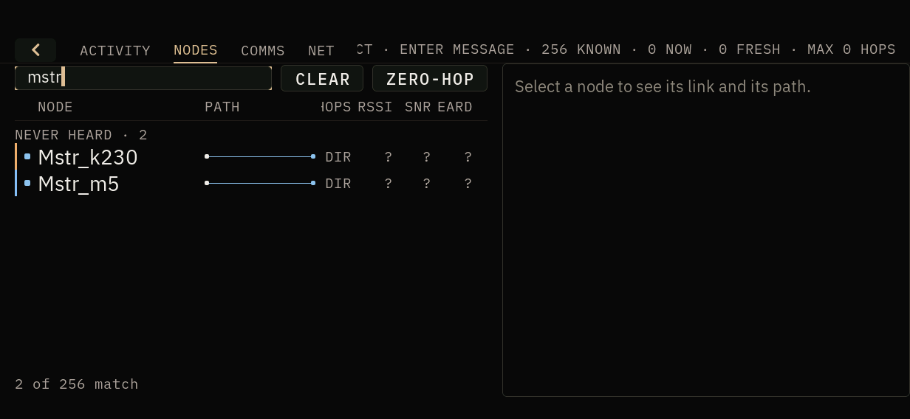
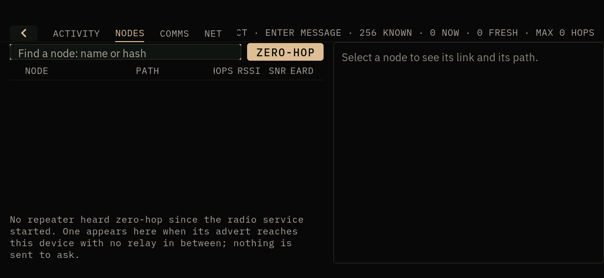
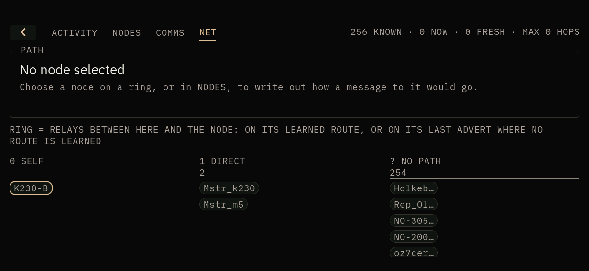

# RIFT management - hardware gate (NOT RUN; unit B smoke only)

Branch `feat/rift-management`. Prepared 2026-10-01. **The full gate below has
not been run.** A no-RF smoke on unit B is recorded at the end ("Unit B smoke,
2026-10-01"). Host evidence is in the branch's commits and in
`docs/apps/RIFT.md` ("Managing the node", "Emoji and other text").

State the unit's build at the top of the sheet when it is run (the shell's
`doors shell info` build id and `meshcored`'s `mesh.info` build), as every gate
sheet does.

## What changed on the unit

| Binary | Why |
| --- | --- |
| `/usr/bin/doors-shell` | RIFT: sender before message, NODES find bar and ZERO-HOP, NET, ACTIVITY's CHANNELS and THIS DEVICE controls, emoji drawn as smileys |
| `/usr/sbin/meshcored` (`S65meshcored`'s `DAEMON`) | `advert_hops` in `mesh.nodes`; `mesh.set_name`, `mesh.path_hash`, `mesh.set_path_hash`; `name_source` in `mesh.identity`; `settings.v1` |

radiod is not changed. A RIFT built from this branch talks to an older
meshcored: ZERO-HOP then has only direct routes to go on, NET has no advert
placement, RENAME is refused as an unknown method, and the path hash choices
say the service has no such setting.

## Before anything

1. Record `sha256sum` of `/usr/bin/doors-shell` and the running meshcored, and
   copy both to `/root/rollback-rift-management/` with a `RESTORE.sh` that puts
   them back and restarts `S65meshcored`.
2. Copy `/var/lib/pocketos/meshcored/{state.v1,channels.v1}` there too
   (`settings.v1` does not exist yet). **Never touch `identity.id`.**
3. Note `MESHCORED_NAME` in `/etc/default/meshcored`. On unit A it is pinned
   (`Mstr_k230`) by the owner's decision: RENAME must be refused there, which
   is itself a check (step 6). Rename on a unit without the pin, or leave it.

## Checks

RF: only steps 7 and 8 transmit, one advert each, at the unit's configured
power. Nothing else here puts a packet on the air.

1. **COMMS sender** - a channel thread with traffic: the claimed name comes
   first (`NAME? text`), a long line wraps under the name, own lines carry no
   name. Both orientations. Capture with `ffmpeg -f kmsgrab`.
2. **NODES search** - type part of a known name in portrait (touch keyboard)
   and landscape (keyboard base); the list narrows as typed; CLEAR and Esc
   restore it; a nonsense query says no node matches. With 200+ nodes, typing
   stays responsive (note shell CPU).
3. **ZERO-HOP** - turn it on; the repeaters listed should be ones known to be
   in direct range (compare `mesh.nodes` `advert_hops: 0`). An empty result
   says so. No `mesh.advert` / `tx_submitted` change while doing it.
4. **NET** - rings populated from the real mesh; tap a multi-hop node: the
   chain is written out and on-route nodes outlined. Landscape columns fit.
5. **CHANNELS** - ADD a HASHTAG channel (e.g. `#doorstest`) and check its hash
   against another MeshCore client joining the same name (T-Deck: hashtag
   channel); LEAVE it through the confirmation; `channels.v1` changes and
   nothing else does. PRIVATE: the key is shown once and gone after DONE.
   KEY: paste a known key; a mistyped key is refused before asking.
6. **RENAME** - on a pinned unit: disabled, with the MESHCORED_NAME caption.
   On an unpinned one: rename, restart `meshcored`, the name survives.
7. **Rename reaches a peer** (unpinned unit only) - after the rename, one
   ADVERT NEAR; the T-Deck shows the new name. *One packet.*
8. **Path hash 2 bytes** - choose 2 B (confirmation), then one ADVERT MESH;
   capture it on a second receiver (`tools/meshcore-frame parse`): the path
   length byte has size bits `01`. Whether repeaters on the bench mesh carry
   it onward is the open question this step answers; record which firmware
   they run. *One packet.* Then back to 1 B.
9. **Emoji** - a channel message from the T-Deck containing 🙂 ❤️ 👍 🚀
   shows `:) <3 (y)` and a box for the rocket.
10. **Back/Home** from every section, and RIFT closed and reopened three
    times: no crash, no keyboard left up, no key left on ACTIVITY.

## Rollback

`/root/rollback-rift-management/RESTORE.sh`, then `rm
/var/lib/pocketos/meshcored/settings.v1` if step 8 left anything but 1 byte
(or set it back from RIFT first).

## Unit B smoke, 2026-10-01

Not the gate: a hot-deploy smoke of the read-only and no-RF paths, run while
the branch was being written. Unit B (`K230-B`), landscape.

**Build on the unit during the smoke:** doors-shell from `2f4a11f` (riscv64
DRM build, sha256 `e1fcd404…`), meshcored from `5bc1ea3` (sha256
`f52e3f30…`). Earlier passes ran shells from `5bc1ea3` and `eff83c6`.
**Build on the unit afterwards:** restored by `RESTORE.sh` to doors-shell
`11ab0d9` and meshcored `749f4f1`, as found; `/root/rollback-rift-management/`
is kept on the unit.

| Check | Result |
| --- | --- |
| RIFT opens on ACTIVITY, read from the top | PASS on `2f4a11f` (on `5bc1ea3` it opened scrolled to the CHANNELS form: fixed in `eff83c6` and `2f4a11f`) |
| THIS DEVICE: RENAME | disabled with the MESHCORED_NAME caption (unit B's name is pinned) - PASS |
| THIS DEVICE: path hash | `1 B` shown as chosen, from `mesh.path_hash` - PASS (not changed) |
| NODES search | `rep` -> 38 of 256, `mstr` -> 2 of 256, Esc restores 256 - PASS |
| ZERO-HOP | empty result, says so: no node had an advert heard in the window - PASS for the empty state only |
| NET | real rings: SELF, DIRECT `Mstr_k230` `Mstr_m5`, 254 NO PATH - PASS |
| COMMS empty note | says channels are joined on ACTIVITY - PASS on `eff83c6`+ |
| Back -> ACTIVITY, Home, reopen | PASS, no crash, 0 ERROR lines in `shell.log` |
| RF | `tx_submitted` 0 throughout: nothing transmitted |

Not exercised on hardware: ADD / LEAVE a channel, a successful rename, path
hash 2 or 3 bytes on air, ZERO-HOP with real advert data, the emoji step, the
COMMS sender order with live traffic. Those are steps 1, 3 (with data), 5-9
above.

