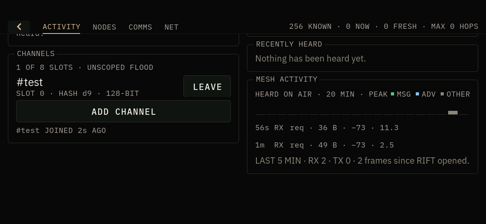
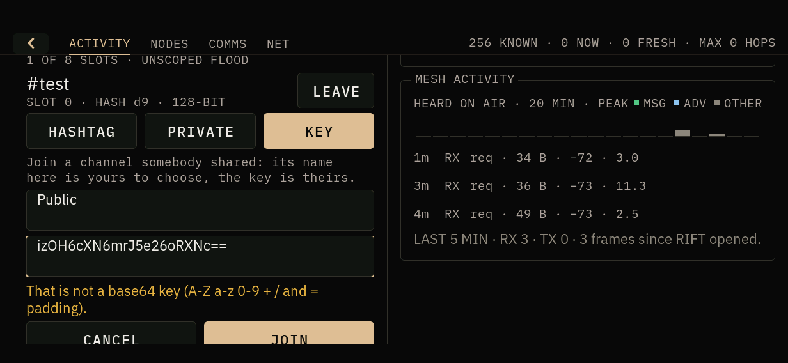
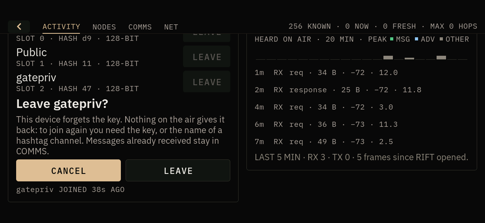
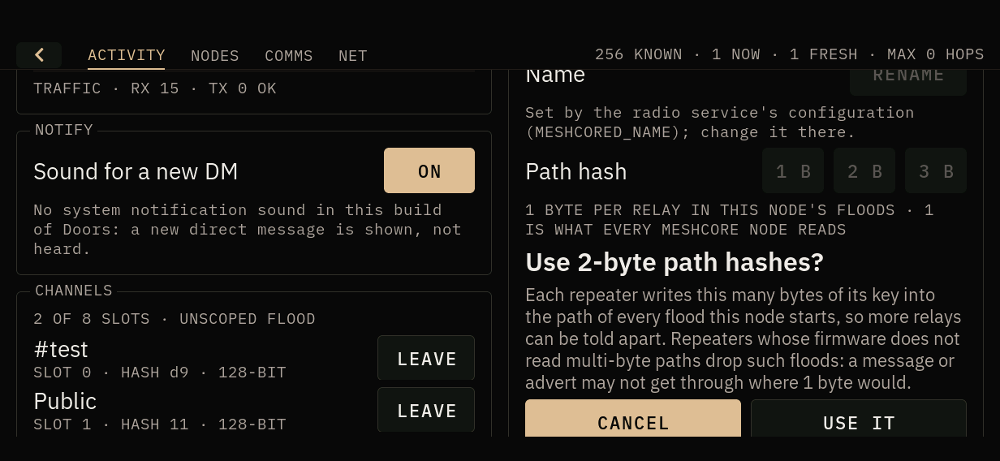
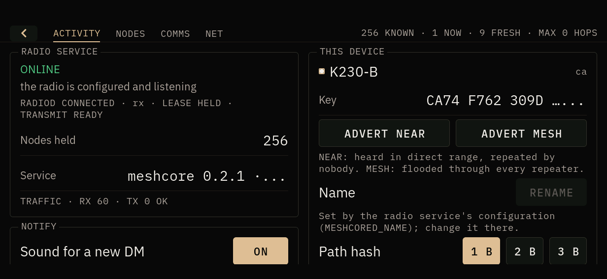
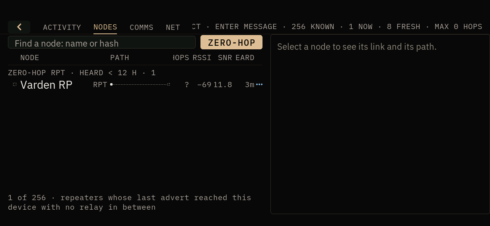
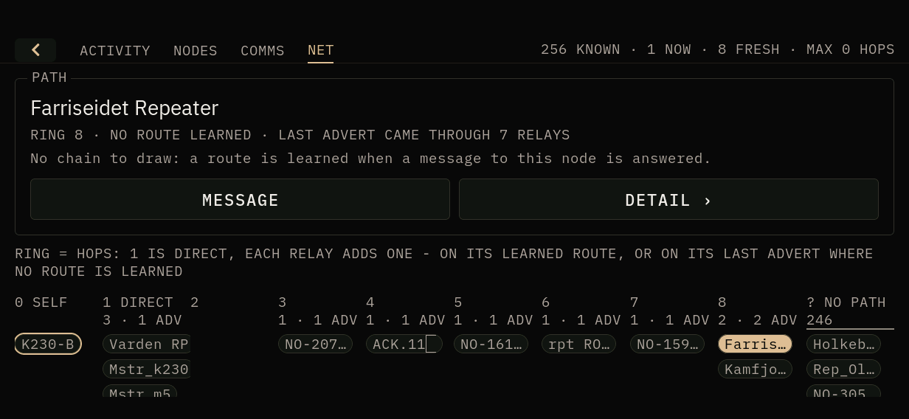
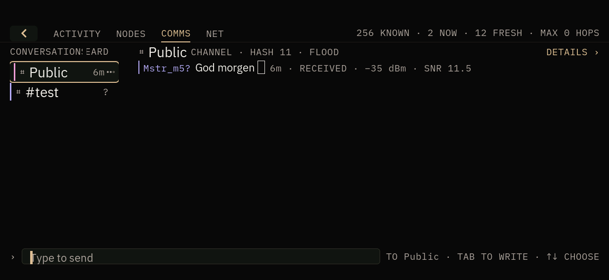
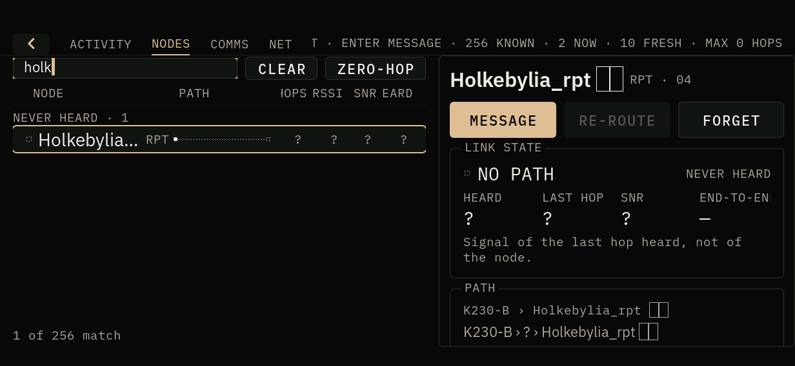

# RIFT management - hardware gate (RUN on unit B 2026-10-02: PARTIAL, no RF)

**Build on the unit when the gate finished:** doors-shell `610f10b` (riscv64
DRM build, sha256 `9d01f47f…`), meshcored `5bc1ea3` (sha256 `f52e3f30…`, md5
`82290302…`; meshcored has not changed since). The gate began on shell
`2f4a11f`; `76a2444` and `0b60975` were deployed during it, each with a fix
for something the gate found (below). **Build on the unit afterwards:**
doors-shell `11ab0d9`, meshcored `749f4f1` (master, md5 `a0642593…` /
`1a7007b2…`), as found.

Branch `feat/rift-management`. Prepared 2026-10-01; run on unit B (`K230-B`,
name pinned by `MESHCORED_NAME`, landscape, text size large) on 2026-10-02
against the live bench mesh. Results are in "Gate run, unit B, 2026-10-02"
after the checklist. **Steps 7 and 8 transmit and were not run**: the one
ADVERT MESH of step 8 was refused by the session's permission policy before
it was sent. Host evidence is in the branch's commits and in
`docs/apps/RIFT.md` ("Managing the node", "Emoji and other text").

## What changed on the unit

| Binary | Why |
| --- | --- |
| `/usr/bin/doors-shell` | RIFT: sender before message, NODES find bar and ZERO-HOP, NET, ACTIVITY's CHANNELS and THIS DEVICE controls, emoji drawn as smileys |
| `/usr/sbin/meshcored` (`S65meshcored`'s `DAEMON`) | `advert_hops` in `mesh.nodes`; `mesh.set_name`, `mesh.path_hash`, `mesh.set_path_hash`; `name_source` in `mesh.identity`; `settings.v1` |

radiod is not changed. A RIFT built from this branch talks to an older
meshcored: ZERO-HOP then has only direct routes to go on, NET has no advert
placement, RENAME is refused as an unknown method, and the path hash choices
say the service has no such setting.

## Before anything

1. Record `sha256sum` of `/usr/bin/doors-shell` and the running meshcored, and
   copy both to `/root/rollback-rift-management/` with a `RESTORE.sh` that puts
   them back and restarts `S65meshcored`.
2. Copy `/var/lib/pocketos/meshcored/{state.v1,channels.v1}` there too
   (`settings.v1` does not exist yet). **Never touch `identity.id`.**
3. Note `MESHCORED_NAME` in `/etc/default/meshcored`. On unit A it is pinned
   (`Mstr_k230`) by the owner's decision: RENAME must be refused there, which
   is itself a check (step 6). Rename on a unit without the pin, or leave it.

## Checks

RF: only steps 7 and 8 transmit, one advert each, at the unit's configured
power. Nothing else here puts a packet on the air.

1. **COMMS sender** - a channel thread with traffic: the claimed name comes
   first (`NAME? text`), a long line wraps under the name, own lines carry no
   name. Both orientations. Capture with `ffmpeg -f kmsgrab`.
2. **NODES search** - type part of a known name in portrait (touch keyboard)
   and landscape (keyboard base); the list narrows as typed; CLEAR and Esc
   restore it; a nonsense query says no node matches. With 200+ nodes, typing
   stays responsive (note shell CPU).
3. **ZERO-HOP** - turn it on; the repeaters listed should be ones known to be
   in direct range (compare `mesh.nodes` `advert_hops: 0`). An empty result
   says so. No `mesh.advert` / `tx_submitted` change while doing it.
4. **NET** - rings populated from the real mesh; tap a multi-hop node: the
   chain is written out and on-route nodes outlined. Landscape columns fit.
5. **CHANNELS** - ADD a HASHTAG channel (e.g. `#doorstest`) and check its hash
   against another MeshCore client joining the same name (T-Deck: hashtag
   channel); LEAVE it through the confirmation; `channels.v1` changes and
   nothing else does. PRIVATE: the key is shown once and gone after DONE.
   KEY: paste a known key; a mistyped key is refused before asking.
6. **RENAME** - on a pinned unit: disabled, with the MESHCORED_NAME caption.
   On an unpinned one: rename, restart `meshcored`, the name survives.
7. **Rename reaches a peer** (unpinned unit only) - after the rename, one
   ADVERT NEAR; the T-Deck shows the new name. *One packet.*
8. **Path hash 2 bytes** - choose 2 B (confirmation), then one ADVERT MESH;
   capture it on a second receiver (`tools/meshcore-frame parse`): the path
   length byte has size bits `01`. Whether repeaters on the bench mesh carry
   it onward is the open question this step answers; record which firmware
   they run. *One packet.* Then back to 1 B.
9. **Emoji** - a channel message from the T-Deck containing 🙂 ❤️ 👍 🚀
   shows `:) <3 (y)` and a box for the rocket.
10. **Back/Home** from every section, and RIFT closed and reopened three
    times: no crash, no keyboard left up, no key left on ACTIVITY.

## Rollback

`/root/rollback-rift-management/RESTORE.sh`, then `rm
/var/lib/pocketos/meshcored/settings.v1` if step 8 left anything but 1 byte
(or set it back from RIFT first).

## Gate run, unit B, 2026-10-02

Unit B alone: unit A did not answer on the bench network and the T-Deck needs
the owner. The second receiver was a listen-only `radio.subscribe` on unit B
itself (`out/rift-gate/ipc.py listen`, never acquires or transmits): 101
frames over 50 minutes, every one parsed for route, hop count and path hash
size. Channel traffic came from the real mesh. `tx_submitted` was **0** from
the first step to the last, and radiod reported no `tx_done`: **nothing was
transmitted.** Keys were typed through `shell.key` (keyboard base matrix
codes), taps and drags through the touch device.

| Step | Result |
| --- | --- |
| 1 COMMS sender | **PASS, landscape.** A live Public message: `Mstr_m5? God morgen` + one box for 🌞 - the claimed sender first, then the body. Portrait not run on hardware (rotation is a stored setting; host covers both) |
| 2 NODES search | **PASS.** `rep` -> 38 of 256, `holk`, `chat`, `skalle` narrow to their nodes, Esc and CLEAR restore 256. Shell CPU while typing at most 9 % (`top`). With ZERO-HOP on, a query that matches no zero-hop repeater says so |
| 3 ZERO-HOP | **PASS with real data.** Empty for the first 25 minutes and said so; then `Varden RP` (type 2) - the radio log has its advert at **0 hops, -69 dBm**; it is the only zero-hop repeater listed. `advert_hops` in `mesh.nodes` matched the radio log's hop count of the first copy of every advert heard (14 adverts from 12 nodes, 0 to 7 relays); the one later copy - Mstr_k230's advert relayed once, same timestamp and signature, 3 s after it came direct - is dropped as already seen, as MeshCore does. No `mesh.advert`, `tx_submitted` 0 |
| 4 NET | **PASS** after a fix. Rings from the real mesh: SELF, DIRECT (Varden RP by advert, Mstr_k230 and Mstr_m5 by route), rings 3-8 by advert, 246 NO PATH. A selected ring-8 repeater reads `RING 8 · NO ROUTE LEARNED · LAST ADVERT CAME THROUGH 7 RELAYS`; the legend said rings were relays, now hops (**F2**). No multi-hop learned route was on the unit, so the chain and on-path outline were not drawn on hardware (host covers them) |
| 5 CHANNELS | **PASS.** HASHTAG `#test` -> hash `d9`, `#doorsgate` -> `49`, both equal to SHA-256(SHA-256("#name")[:16])[0] computed apart; KEY `Public` with upstream's `PUBLIC_GROUP_PSK` -> `11` (unit A's Public is `11`), and the same key one character short refused on the form, nothing sent; PRIVATE `gatepriv`: a 16-byte key shown once, its hash (`47`) equal to the service's, gone after DONE; a duplicate `test` refused before asking (`A channel called #test is joined already (slot 0)`); LEAVE through its confirmation, CANCEL keeping the channel. Hash checked by computation, not against a second client: the T-Deck step is still open |
| 6 RENAME | **PASS on a pinned unit**: disabled, with the MESHCORED_NAME caption. Rename on an unpinned unit not run (unit B is pinned; un-pinning it is a configuration change left to the owner); the host's live session covers the rename |
| 7 Rename reaches a peer | **NOT RUN** (transmits; needs an unpinned unit and the T-Deck) |
| 8 Path hash 2 bytes | **Setting PASS, on-air NOT RUN.** 2 B through its confirmation -> `mesh.path_hash` 2, `settings.v1` `path_hash_bytes=2` at 0600; back to 1 B directly, no confirmation. The one ADVERT MESH was refused before it was sent. What the step asked about repeaters is answered by the radio log: the bench mesh carries floods with **2-byte paths (26 frames, up to 11 relays) and 3-byte paths (4 frames, up to 10 relays)** next to 1-byte ones - its repeaters forward multi-byte path floods |
| 9 Emoji | **PARTIAL.** No 🙂 ❤️ 👍 arrived, so no smiley was seen drawn on hardware (host covers it). Real emoji did arrive: 29 node names and one message carry ☀️ 🐵 🏠 🌞 flags and more, none in the smiley table, each drawn as a box - and an emoji followed by U+FE0F as **two** boxes (**F3**, fixed in `610f10b`; that render seen on `0b60975`, the fix verified on the host) |
| 10 Back/Home | **PASS.** Each section, Back, Home and reopen, three times over: ACTIVITY opens at the top every time, no crash, 0 ERROR lines in `shell.log` |

### Found and fixed during the gate

- **F1** - after any channel join or leave, THIS DEVICE's path hash buttons
  lost their chosen accent: no size looked chosen. Enabling a button restyled
  it as secondary and only a size change re-applied the accent. Fixed in
  `76a2444`; seen fixed on unit B after a `#doorsgate` join and leave.
- **F2** - NET's legend said a ring was the relays between here and the node;
  ring 1 is DIRECT and the PATH panel says ring 8 for seven relays. The legend
  now counts hops (`0b60975`), as handoff §7 and `docs/apps/RIFT.md` do.
- **F3** - a variation selector after an emoji with no smiley drew a second
  box (13 of the 29 emoji names on this mesh). `rift_text_shown` drops
  U+FE0E, U+FE0F and U+200D wherever they are (`610f10b`).

Each fix has a rift_app_test or rift_format_test check; F1's check was seen to
fail without the fix.

### Seen, not changed

- **Already on master at text size large** (A/B with master `11ab0d9` on the
  same unit after the restore): the shell header's key hint clipped on NODES
  (`…CT · ENTER MESSAGE`), NODES' `HOPS`/`HEARD` column titles clipped, COMMS'
  `CONVERSATIONS` and `HEARD` titles overlapping, MESH ACTIVITY's caption
  `NOTHING` cut to `NOTH` by its legend. Not from this branch.
- Opening ADD CHANNEL does not put the keyboard base's keys into its name
  field; the field takes them once tapped. A form does not move focus inside
  its own event (LVGL rule); a keyboard-only user reaches the field with TAB.
- A key's refusal caption stays up while the key is being corrected, until
  the next JOIN.

### State before and after

Unit B before: no `channels.v1`, no `settings.v1`, 256 nodes in `state.v1`,
`/etc/default/meshcored` with `MESHCORED_NAME=K230-B`. Joined and left during
the gate: `#test`, `Public`, `gatepriv`, `#doorsgate`, each through RIFT.
After `RESTORE.sh`: master binaries, `settings.v1` removed, the header-only
`channels.v1` the leaves left behind removed, `/etc/default/meshcored`
byte-identical to the copy taken before, `identity.id` never opened (mtime
still 1970). Copies taken before the gate are in
`/root/rollback-rift-management/gate-20261002/`.

### Left for the owner

Step 5 against the T-Deck (join `#test` or `#doorsgate` there and exchange a
message), steps 7 and 8 on air (one packet each), a rename on an unpinned
unit, step 1 in portrait, and step 9 with a 🙂 / ❤️ / 👍 sent from the T-Deck.

## Unit B smoke, 2026-10-01

Not the gate: a hot-deploy smoke of the read-only and no-RF paths, run while
the branch was being written. Unit B (`K230-B`), landscape.

**Build on the unit during the smoke:** doors-shell from `2f4a11f` (riscv64
DRM build, sha256 `e1fcd404…`), meshcored from `5bc1ea3` (sha256
`f52e3f30…`). Earlier passes ran shells from `5bc1ea3` and `eff83c6`.
**Build on the unit afterwards:** restored by `RESTORE.sh` to doors-shell
`11ab0d9` and meshcored `749f4f1`, as found; `/root/rollback-rift-management/`
is kept on the unit.

| Check | Result |
| --- | --- |
| RIFT opens on ACTIVITY, read from the top | PASS on `2f4a11f` (on `5bc1ea3` it opened scrolled to the CHANNELS form: fixed in `eff83c6` and `2f4a11f`) |
| THIS DEVICE: RENAME | disabled with the MESHCORED_NAME caption (unit B's name is pinned) - PASS |
| THIS DEVICE: path hash | `1 B` shown as chosen, from `mesh.path_hash` - PASS (not changed) |
| NODES search | `rep` -> 38 of 256, `mstr` -> 2 of 256, Esc restores 256 - PASS |
| ZERO-HOP | empty result, says so: no node had an advert heard in the window - PASS for the empty state only |
| NET | real rings: SELF, DIRECT `Mstr_k230` `Mstr_m5`, 254 NO PATH - PASS |
| COMMS empty note | says channels are joined on ACTIVITY - PASS on `eff83c6`+ |
| Back -> ACTIVITY, Home, reopen | PASS, no crash, 0 ERROR lines in `shell.log` |
| RF | `tx_submitted` 0 throughout: nothing transmitted |

Not exercised on hardware: ADD / LEAVE a channel, a successful rename, path
hash 2 or 3 bytes on air, ZERO-HOP with real advert data, the emoji step, the
COMMS sender order with live traffic. Those are steps 1, 3 (with data), 5-9
above.

