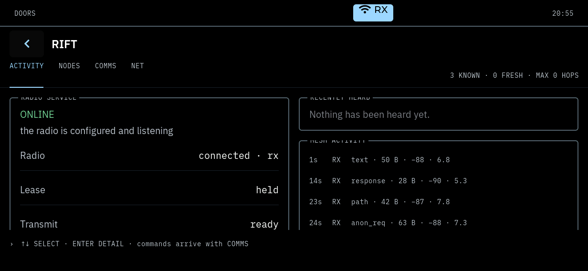
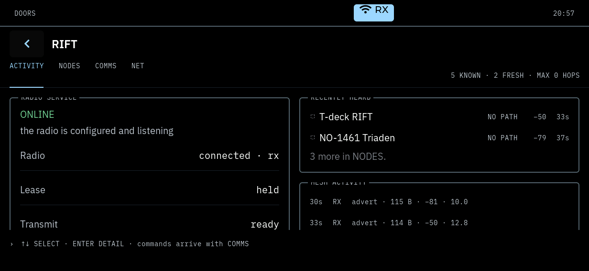

# RIFT phase 1 on unit A: bench gate

**The build on unit A is `d19146b`** — branch `feat/rift-ui-phase1`, tip
`d19146ba7d55ec0fcb8e86ee9050e7488e410c55`, from origin/master `0bfaa08`.
VERSION stays 0.0.10. Not merged.

**Result: PASS on unit A, 2026-09-19.** A userspace deployment of one binary,
health checks over SSH and the unit's own DRM plane, then the product owner's
physical check. **The product owner reported PASS on 2026-09-19.**

Scope: the RIFT app only. No service was replaced, no init script was added,
no image was built, the SD card was not touched, and nothing transmitted.

## What was deployed, and why only this

RIFT is an in-process app (ADR-002): it is compiled into `pocketos-shell` and
installed as `/usr/bin/doors-shell`. It has no separate binary, no assets (it
has no launcher icon mask — see "Known gaps" in docs/apps/RIFT.md), no store
and no configuration file. The `doors` CLI takes its app list from the shell
over `shell.*` and holds no app table of its own, so it did not need
replacing either.

**The whole payload is one file.**

| Path | Before | After |
| --- | --- | --- |
| `/usr/bin/doors-shell` | `efdbde9805b226aa93018c99d58f86b36dcb50498a6222ad68c962d172e6e7b3` (646dcbb) | `36497c8f042430cc10d6b20f0e60b363f35767a6db28a5c7605bda543e1e2588` (d19146b) |

Untouched: `radiod`, `meshcored`, `sysd`, `netd`, `doors`/`pos`,
`pos-supervise`, every init script, `/etc/default/*`, `/etc/doors-release`,
the boot partition.

### Provenance

The tree was taken out of the git object store at the exact commit
(`git archive d19146b`), so nothing uncommitted in the working checkout could
reach the binary, and `BUILD_ID` was written beside `VERSION` the way
`apply_to_sdk.sh` does when it exports a tree with no git history. Built with
the Buildroot toolchain, `-DPOCKETOS_DISPLAY=drm -DPOCKETOS_LVGL_MODE=sysroot`:
rc 0, **0 warnings**.

| Check on the artefact | Result |
| --- | --- |
| Architecture | ELF 64-bit LSB pie, UCB RISC-V, RVC, double-float ABI |
| Version and build compiled in | `0.0.10`, `d19146b` |
| Occurrences of `mesh.send` or `mesh.advert` | **0** |
| Launcher order | RIFT last, so no other app's tile moved |
| Installed hash equals the build host's | yes, verified on the unit after extraction |

The transfer used the discipline of `platforms/k230/scripts/deploy.sh`
restricted to one file: root ownership from the archive rather than the
builder's uid, the service stopped and confirmed stopped before its binary
was replaced, and a rollback copy kept on the unit.

### What rides along with it

Replacing a single linked binary necessarily brings master's shell-side drift
since the unit's `646dcbb`. Between `646dcbb` and `d19146b`, outside
`apps/rift/`, the shell's source set changed in:

- `ui/pocketui/pocketui.{c,h}` — the shared responsive-layout guard, and
  `apps/{calculator,calendar,clock,fleet,notes,radar,settings,system}` moved
  onto it (master `b784f3b`, `42983da`);
- `core/pocketipc/server.{c,h}` — the disconnect callback (master `a295133`,
  `5f12a4b`).

Master also touched `ui/shell/CMakeLists.txt` in that range, but only inside
`if(POCKETOS_DISPLAY STREQUAL "sdl")`, to add the `pocketui_layout_test`
executable. This artefact is the `drm` build, so that block was never
evaluated for it.

All of it is already on master. From this branch the binary carries
`apps/rift/**`, six lines of `ui/shell/shell.c` (registration) and the
CMakeLists entries, and nothing else.

## Unit provenance

`/etc/doors-release` still reads `BUILD_ID=646dcbb`: it is the flashed
userspace's file and was not replaced. The **running shell** is what changed,
and it says so itself:

```
2026-09-19T20:53:49.165Z shell INFO  start version=0.0.10 build=d19146b pid=3459
```

`doors shell info` reports `"version": "0.0.10", "build": "d19146b"`. The
userspace around it is the mixed bench userspace of the meshcored gate, not a
release.

SSH note: unit A's host key changed when it was reflashed for v0.0.10, and
`StrictHostKeyChecking=no` does not bypass a *changed* key. As in
CLOCK_ROTATION_STATE_GATE.md, the session used a scratch `known_hosts` seeded
by `ssh-keyscan`, so the developer's own file was neither read nor written.
Key seen: `SHA256:3Amsv7zIfgqfWFc4N7LR+pHa8gRS+yQS1NFP4Ruw9v4`.

## meshcored

Started by hand with the command line of MESHCORED_HARDWARE_GATE.md. No
`S65meshcored` was installed and no `/etc/default/meshcored` was written, so
the service still cannot start on its own and a reboot leaves it off.

```
meshcored --name K230-A --frequency-mhz 869.618 --bandwidth-khz 62.5 \
          --spreading-factor 8 --coding-rate 5 --sync-word 0x12 \
          --preamble 32 --tx-power-dbm 2 --verbose
```

| Observation | Value |
| --- | --- |
| `starting` to `online` | **81 ms** (20:53:09.789Z to 20:53:09.870Z) |
| Transitions | `starting` -> `waiting_for_radiod` -> `configuring` -> `online` |
| State changes after that | **none**, for the whole 538 s session |
| Lease | acquired, `owner_id 3`; `radiod` logged it from its own side |
| Binary | `e241805`, unchanged, sha256 `d824449015c7…` |
| Identity | `K230-A`, hash `19`, key `19f7b327a254fe8a…`, the persistent one |
| `radiod` | `rx` throughout, pid 1583, never restarted |

## The client, verified

`mesh.*` was probed read-only from the build host through
`ssh -L 19876:/run/pocketos/meshcored.sock`, alongside what the app itself
drew.

| Method | Result |
| --- | --- |
| `mesh.status` | `online`, reason "the radio is configured and listening", radio connected, `radio_state` `rx`, lease held, online |
| `mesh.identity` | `K230-A`, node hash `19`, public key `19f7b327…3715` |
| `mesh.nodes` | answered; 3 at start, 6 at the end — the mesh was learned live |
| `mesh.node` (2-hex prefix) | answered with the one matching node |
| Subscription | **active**: see below |

The subscription is not asserted from a log line — it is visible in what the
panel drew. Between two captures **101 s apart** (20:55:44 and 20:57:25),
with no input of any kind, the section strip went from `3 KNOWN · 0 FRESH` to
`5 KNOWN · 2 FRESH`, and RECENTLY HEARD went from "Nothing has been heard
yet." to two real nodes — `T-deck RIFT` −50 dBm and `NO-1461 Triaden`
−79 dBm — over a `3 more in NODES.` line. Those rows can only arrive as
`mesh.node` and `mesh.activity` events.

MESH ACTIVITY corroborates it from the other side: its two newest rows in the
second capture are adverts that arrived inside that interval, 30 s and 33 s
before the capture at −81 and −50 dBm. The 33 s / −50 dBm advert is the one
behind `T-deck RIFT`'s own row, which reads the same age and the same signal.
The advert behind `NO-1461 Triaden` (37 s, −79 dBm) is below the visible
crop.

Both captures are of the unit's own DRM plane (`ffmpeg -f kmsgrab`),
1232 × 568, with the panel clock legible in each.





### Counters, whole session

```
state=online  uptime_s=538  nodes=6
RX  events=52  delivered=52  rejected=0  dropped=0
TX  submitted=0 accepted=0 refused=0 ok=0 failed=0  sent_flood=0 sent_direct=0
nodes_unretained=0  contacts_full=0
```

**Nothing was transmitted.** Not by RIFT, which has no method that can, and
not by meshcored, which was never asked to and was addressed by nobody.

## Lifecycle, on hardware

The physical test attached and detached the keyboard base, which makes the
shell restart in place to reopen the display at the other rotation. RIFT was
therefore created, destroyed and created again twice, against a live service:

| Time | |
| --- | --- |
| 20:54:34 | `rift: open, meshcored connected` (landscape, first open) |
| 20:59:29 | keyboard removed; `close app rift`; shell restarts in place at rotation 0 |
| 20:59:35 | `rift: open, meshcored connected` (portrait) |
| 21:00:37 | keyboard attached; `close app rift`; shell restarts in place at rotation 270 |
| 21:00:40 | `rift: open, meshcored connected` (landscape) |

Three opens, three connections, two clean closes, no crash report, no
supervisor restart — the last entry in `supervise-doors-shell.log` is the
deliberate stop of the deployment at 20:52:16. The launcher was `6 column(s),
2 row(s)` in landscape and `2 column(s), 6 row(s)` in portrait: twelve tiles
either way, no overflow.

## WARN and ERROR

| Source | Count | |
| --- | --- | --- |
| `meshcored` | **0 WARN, 0 ERROR** | whole run; no log line after start-up |
| `radiod` | **0 WARN, 0 ERROR** | since meshcored started |
| `doors-shell` | 2, **neither RIFT's** | see below |

The two:

- `ERROR built without LODEPNG/SNAPSHOT, no screenshot` — a `doors shell
  screenshot` attempt made during this session. A documented limitation, not
  a fault: the target `lv_conf.h` is the vendor package's and has
  `LV_USE_SNAPSHOT 0` (docs/KNOWN_ISSUES.md, decision H2, 2026-09-06). The
  panel was captured with `ffmpeg -f kmsgrab` instead, as the landscape gates
  did.
- `WARN keyboard: the controller stopped answering; retrying` — the TCA8418
  at the moment the base was physically unplugged. The next lines show it
  handled: `keyboard absent: rotation 0`.

Worth noting against MESHCORED_HARDWARE_GATE.md, which recorded 4 WARN on
`doors-shell` (`radio.status poll failed` during meshcored's transmits):
**none of those appeared here**, which is consistent with nothing
transmitting.

## The product owner's physical check

Reported by the product owner on 2026-09-19 as **PASS**, over:

- the launcher and opening RIFT;
- ACTIVITY;
- NODES;
- node selection and the detail;
- scrolling and touch;
- portrait layout;
- landscape layout, with the keyboard base attached;
- reconnect behaviour.

The log above corroborates the orientation half of that list — the two
rotations, the restarts and the three reconnections are in it — and this
sheet does not restate the rest as anything but the owner's report.

## Limits of this gate

- **Nothing transmitted**, so nothing downstream of a transmit was exercised:
  no `mesh.send`, no ACK, no return path, no `no_ack` treatment. RIFT has no
  way to reach any of it in this phase.
- **COMMS and NET are not in this build** and were only seen saying so.
- **No relayed node appeared.** Every node with a known route was direct, so
  the hop strip's compression, the hop ladder past one hop, the path chain
  over relays and the `n UNKNOWN HOPS` uncertainty line were **not exercised
  on real data**. They are covered host-side (tests/rift_format_test.c, and
  the fixtures in tests/rift_app_test.c), not here. The strip caption read
  `MAX 0 HOPS` for the whole session, which is literally correct and is the
  one thing on screen that a relayed neighbour would change.
- **No stale node.** Nothing crossed the 12 h boundary during a 9-minute
  session, so the "NOT HEARD > 12 H" group was drawn from persisted nodes
  that had never been heard rather than from nodes that had gone quiet.
- **The service was never lost while RIFT was watching**, except as the owner
  exercised it; this sheet records no measurement of the reconnect path.
- **No second client** competed for meshcored, beyond the short read-only
  probe above.
- `meshcored` is `e241805`, which predates the own-transmit state fix
  (`0bfaa08`). That fix only bears on this node's own transmits, of which
  there were none.

## Final unit state

Left deliberately, and exactly:

- **`doors-shell` `d19146b` running** under its supervisor, pid 3459, with
  **RIFT open**, in landscape (keyboard base attached).
- **`meshcored` `e241805` running by hand**, pid 3316, `online`, holding the
  lease, having transmitted nothing. It has no init script, so a reboot
  leaves it off and the shell returns to the launcher.
- **`radiod` `e241805` running** on the real SX1262, pid 1583, state `rx`,
  untouched.
- The `K230-A` identity and `state.v1` remain; the node table has grown to 6
  from live air traffic.
- **Rollback copy of the replaced shell** at
  `/root/rift-bench-backup/doors-shell-646dcbb`
  (sha256 `efdbde9805b226aa93018c99d58f86b36dcb50498a6222ad68c962d172e6e7b3`).
- The flashed card was not touched.

### Reversal

```sh
ssh root@192.168.10.157 "/etc/init.d/S90doors-shell stop && \
  cp -a /root/rift-bench-backup/doors-shell-646dcbb /usr/bin/doors-shell && \
  /etc/init.d/S90doors-shell start"
ssh root@192.168.10.157 "killall meshcored"
```

## Verdict

**RIFT phase 1 on real hardware: PASS.** Not merged.
