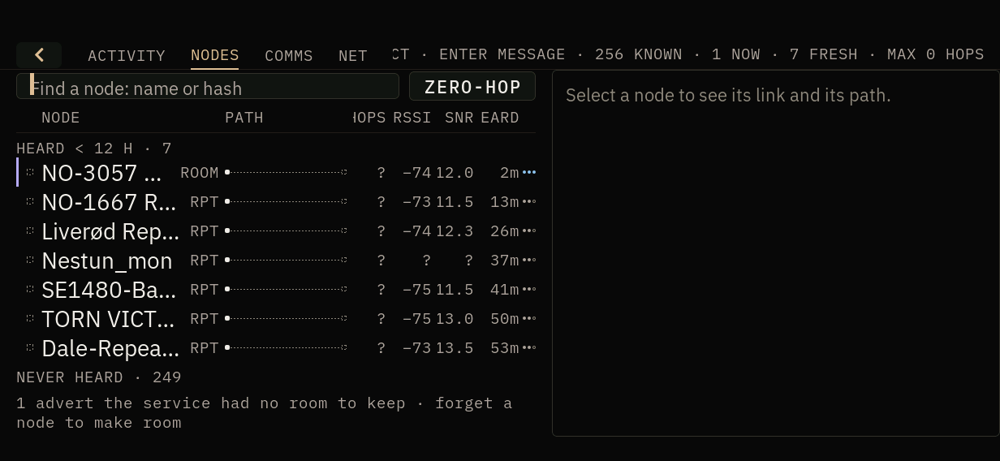
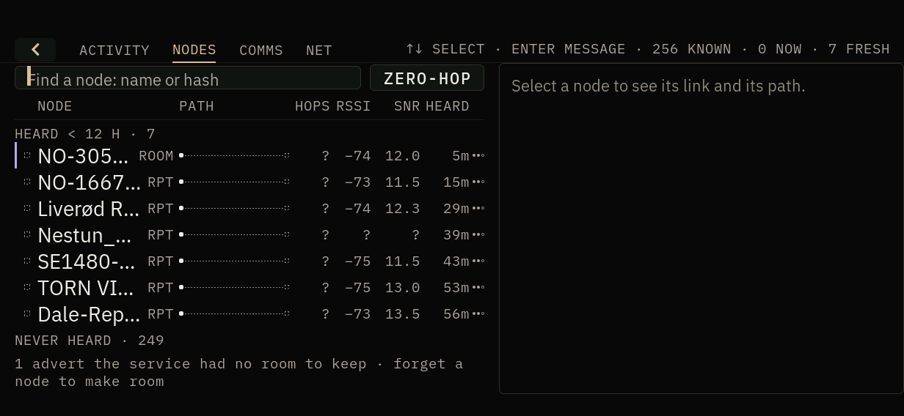
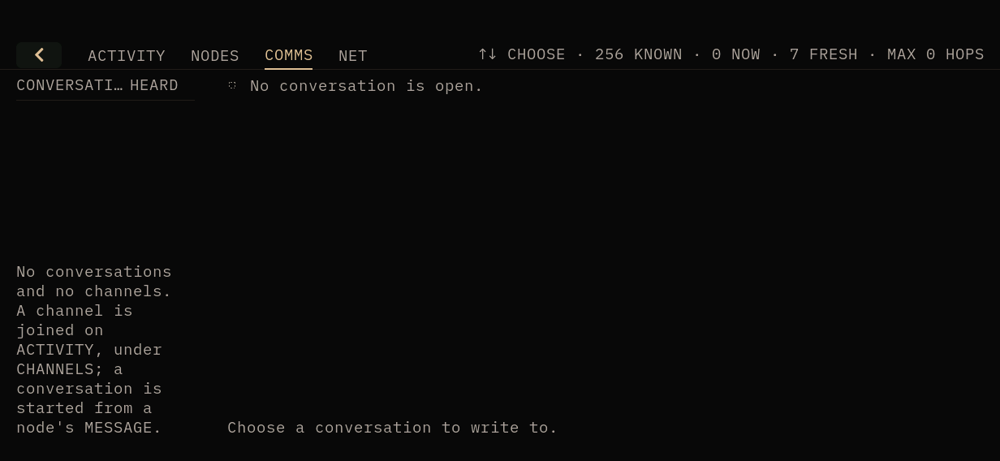
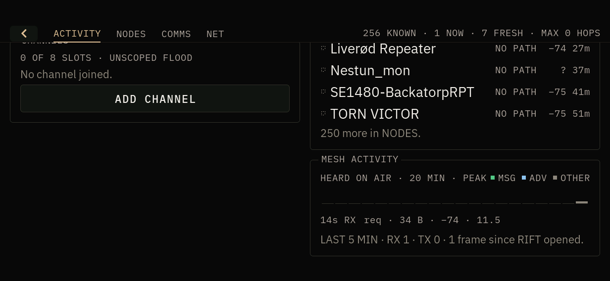
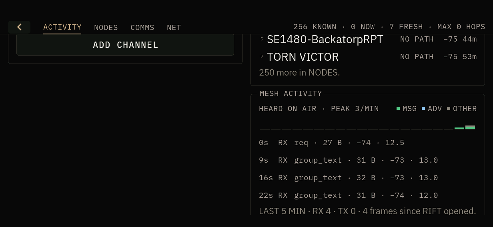
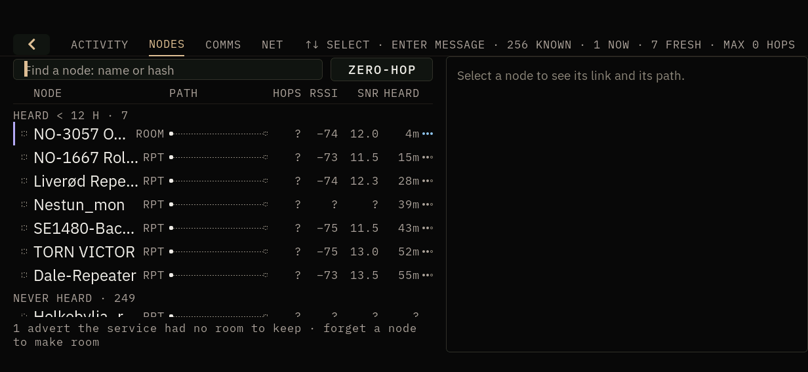
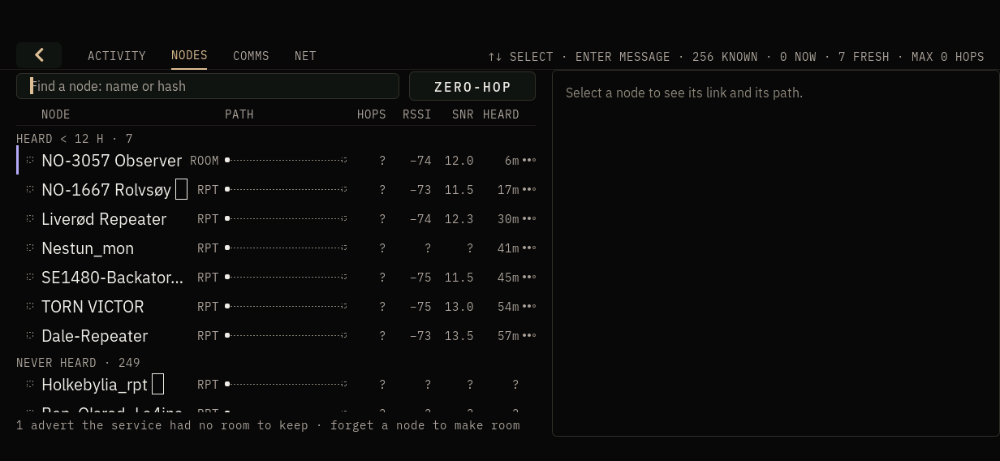

# RIFT captions at every text size - hardware gate

Branch `fix/rift-text-size-captions` (PR #23). This is the fix for what
`RIFT_MANAGEMENT_GATE.md` lists under "Seen, not changed": four captions
clipped at text size Large in landscape.

**Unit B on build `41d315b`** (doors-shell only, hot-swapped over master
`9eda04e`; every other binary still master `9eda04e`).

| | |
|---|---|
| Date | 2026-10-02, 06:04-06:12Z |
| Unit | B (`K230-B`), landscape 1232x568, rotation automatic |
| Before | master `9eda04e` in full, doors-shell md5 `8ae76713`, text size `large` (the owner's) |
| Deployed | doors-shell `41d315b`, riscv64 DRM/sysroot build from a clean clone, 0 first-party warnings, md5 `0568c416` |
| Rollback | `/root/rollback-rift-text-size/RESTORE.sh` (doors-shell `8ae76713` and `settings.conf`) |
| Mesh | meshcored online, 256 nodes, `tx_submitted` 0 before and after |

## Result: PASS

The captures were taken on the panel. "Before" means the master shell. "After"
means this branch. Sizes were set with `doors call shell shell.text_size`;
RIFT was opened with `shell.open id=rift`, and the tabs were tapped.

| Seen at Large | Before (master `9eda04e`) | After (`41d315b`) |
|---|---|---|
| NODES strip key hint | `…CT · ENTER MESSAGE · 256 KNOWN · …` | `↑↓ SELECT · ENTER MESSAGE · 256 KNOWN · 0 NOW · 7 FRESH` |
| NODES column titles | `IOPS` / `EARD` | `HOPS` / `HEARD` |
| COMMS list titles | `CONVERSATIONSEARD` | `CONVERSATI… HEARD` |
| MESH ACTIVITY caption | `HEARD ON AIR · 20 MIN · PEAK` (value cut by the legend) | `HEARD ON AIR · PEAK 3/MIN` |

- At Small, NODES and COMMS draw as on master: the full hint, ending in
  `MAX 0 HOPS`, `CONVERSATIONS` whole, and the same columns.
- At Medium, the hint drops `MAX … HOPS`, `CONVERSATIO…` is fitted, and the
  columns are whole.
- No transmit: `tx_submitted` stayed 0. No crash file. `doors-shell` and
  `meshcored` kept their pids through the size changes (28070 / 27152).
- The text size went back to `large`. `settings.conf` is byte-identical to the
  copy taken before the gate.

## Not covered

- Portrait on the unit (the host test covers it).
- A COMMS conversation open on the unit: unit B has no conversations or
  channels, so the thread header's route chain was not seen on the panel. The
  host test covers it.
- Unit A.

## State after

Unit B is **left on doors-shell `41d315b`**, at text size `large`, with RIFT
open. To go back to master `9eda04e`:

    sh /root/rollback-rift-text-size/RESTORE.sh

Root fs is at 88% (61.8 MB free). The older rollback directories in `/root` are
not pruned.
